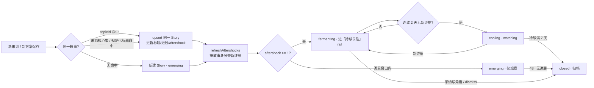

# WeMediaBuddy「持续关注」rail 重设计：从 backlog 到事件关注

> **已被取代**：本稿主导地位由 `2026-08-06-today-editor-desk-design.md`（主编办公台 · 北极星修订版）取代。
> 工程事实继续沿用；信息架构、文案与验收标准以新稿为准。本稿保留作设计历史。

日期：2026-08-06 ｜ 作者：FermentDesigner ｜ 状态：设计建议（未实现）

## 0. 产品定位（Owner 锁，高于本方案一切细节）

**今日页 = 主编办公台。** 不是情报任务状态页，也不是资料堆。

| 角色 | 是谁 | 职责 |
|---|---|---|
| 用户 | 主编 | 取舍与拍板：现在写什么、为什么、怎么做 |
| AI | 编辑 | 把当下最值得做的选题/运营方案递上桌 |

| 页面 | 定位 | 用户第一眼应看到 |
|---|---|---|
| **今日** | 主编办公台 | 当前可批的选题/方案（机会判断主视野） |
| **发现** | 情报现场 | 信息流、新料、渠道/任务流水与扫描状态 |
| **资料库** | 有价值内容沉淀室 | 需要时再查；不是日常第一落点 |

**硬约束（违反即设计失败）：**

1. 今日第一眼必须始终能看到「当前可批的选题/方案」。
2. 新一轮情报或方案未生成完成时，**不得撤掉旧方案变成空态**。
3. `partial` / 任务进度 / 扫描流水 **不得占掉今日主视野**；任务状态叙事归发现侧。
4. 今日只服务机会判断：现在写什么、为什么、怎么做。资料列表、渠道就绪、跑批进度均降级为次要或外链到发现。

本方案的「持续关注」是办公台上的**次席**（仍值得盯的事件），**主席**永远是当前可批选题/方案。持续关注不得反客为主，也不得用 backlog 冒充可批方案。

## 0.1 本方案结论（在定位之下）

把「仍在发酵」从"跨日未消化机会 backlog"改为"**持续关注**"语义：一事件一卡（Story 稳定身份）、卡上必须能回答"为何还在关注"、无后续影响证据的旧机会一律不进此 rail（回到机会池或待处理）。对外文案统一用「持续关注」，不用主标题+副标题。状态机沿用现有 carry 五态，映射为 emerging → fermenting → cooling → closed。MVP 只动展示层 + 按故事身份合并，1–2 天可交付。

**不选更重方案的原因**：不新建图数据库 / 不引入事件实体表，因为 ① 约束要求复用 plan_items + carry 状态机；② 现有 work_carry_items 已有 topic_id、source_ids_json、aftershock_json，加一列 story_id 或在 refresh 时派生即可承载故事身份，无需新存储；③ 发布链路、precise grants、浏览器绑定一律不动。

---

## 1. 问题重述（5 行）

1. **名实不符**：rail 原叫「仍在发酵」，实际展示的是跨日未消化机会 backlog——实库 5 条活跃 carry 的 reason 全是「写入今日方案时进入续命池」这类待办语义，人类编辑看到的是堆积，不是"事件还值得盯"。
2. **同一故事被措辞拆成多行**：`fingerprintPlanItem` 是 `normalizeTitle(title)+topicId+sourceIds` 的字面哈希，措辞/来源一变就新行。实库当前可见 2 条移民规则卡并排（`9b1de53d`「移民规则又更新了吗：Statement of…」 vs `9faeb392`「英国移民规则又更新：HC 259（2026…」），上下文记录的 3 条 AI 写作相似卡属同类症状。
3. **aftershock 失效**：`refreshAftershocks` 以 `if (!item.topicId) continue` 开头、按 topic_id JOIN 查新来源；实库 5/5 活跃行 topic_id=null → aftershock 全空 → "余波证据"从未点亮，卡面也无处展示它。
4. **合并补丁治标不治本**：`mergeSimilarCarryItems` 是未提交补丁（`src/main/ferment.ts` 当前有 1 处 unstaged 修改），只在 `refreshWorkCarry` 前按**来源重合**合并，救不了无 topic 行，也不等于故事身份。
5. **语义落地偏差**：设计文档想要"滚动机会池 + 余波"，实现层把 carry 当续命待办；UI 卡面只显示 标题+天数+来源日期+创建按钮，与"持续关注"一词无一处对应。

---

## 2. 对象模型（人类编辑心智）

| 对象 | 定义 | 关键规则 |
|---|---|---|
| **Story / 事件卡** | 一个正在发生、仍有后续影响的事件（如「英国移民规则 HC 259 更新」） | 稳定身份（storyId）；标题可取最新措辞，身份不变；是 rail 的最小展示单元 |
| **Opportunity / 可写角度** | 附着在 Story 上、今天可以落笔的具体角度（如「给留学生的 Right to Rent 检查清单」） | 可更新（换角度、换受众），**不可平行分裂**——同一角度不得多行挂；一 Story 当前至多一个主角度 |
| **Backlog / 未消化** | 被评估过值得写、但今天没写/没写成的机会 | 与持续关注**分离**：不进持续关注 rail，归「今日机会池」；用户显式移入关注除外 |

一句话：**编辑盯的是"事"，不是"没写完的题"**。

---

## 3. 状态机（推荐 4 态，映射现有 carry 五态）

现有 `CarryState = active | watching | done | dismissed | expired`，保留不删，stage 语义派生：

| 阶段 | 现有 state 映射 | 进入充要条件 | 退出充要条件 |
|---|---|---|---|
| **emerging 事件新起** | active（无余波） | 同一故事规则下无现存活跃卡（新建）**且**事件被判"可能继续演化"（timeliness ≠ evergreen，或含未完结影响/多日事件标记） | → fermenting：出现 ≥1 条新证据（aftershock≥1）或编辑点「继续关注」；→ closed：48h 无新证据且无未完结影响，或 dismiss |
| **fermenting 持续关注** | active（有余波） | **同一 story 的 firstSeenAt 之后出现 ≥1 条新来源/新进展（aftershock≥1）**，或编辑手动「继续关注」 | → cooling：连续 2 天无新证据落入该 story 且未采纳；→ closed：采纳写角度（done）、dismiss、或关注满 14 天无采纳 |
| **cooling 降温观察** | watching | 从 fermenting 退出且无新证据 ≥2 天 | → fermenting：又有新证据（回热）；→ closed：冷却满 7 天无回热（自动 expired 语义）或 dismiss |
| **closed 终态** | done / dismissed / expired | done（已写角度）、dismissed（人工否决）、expired（超时自动） | 不自动复活；仅编辑显式恢复可回 fermenting |

> 工程语义：fermenting 与 emerging 的区分**在 refresh 时派生**（`aftershock_json` 非空 → fermenting），MVP 无需加列；完整版可加 `stage` 列固化判断结果，避免 refresh 时序依赖。

---

## 4. 「持续关注」rail 信息架构

- **一故事一卡**：以 storyId 聚合，卡面标题显示最新措辞；同一 story 的旧行全部折叠进卡（不并排）。
- **卡面必见 4 字段**（缺一不可，缺则不出现在此 rail）：
  1. **为何关注**：余波/新证据摘要 1–2 条（取 `aftershocks[0..1].title`），或「未完结影响」标记（如政策后续、官方回应未出）
  2. **已关注天数**：`fermentedDays`（沿用现有计算）
  3. **最新进展**：最近一条新证据的日期 + 一句话（无则显「暂无新进展」）
  4. **建议动作**：可写角度一行（Opportunity），附「写」按钮（复用现有 `createFromCarry`）
- **无后续影响的旧机会不得进此 rail**：无 aftershock 且无「未完结影响」标记的卡 → 回落机会池，不进「持续关注」。

### UI 文案建议（统一说法，无主副标题）

| 位置 | 文案 |
|---|---|
| rail 标题 | 「持续关注 · N」 |
| 卡面字段 | 「为何关注」/「已关注 N 天」/「最新进展」/「建议动作」 |
| 空态 | 「没有需要持续关注的事件。」 |
| 降温区 | 「观察中」（watching/cooling 折叠展示，不占主列表） |
| 无余波去向 | 机会池加标签「待处理」，与持续关注 rail 分家 |

---

## 5. 主编办公台信息架构与边界

### 5.1 今日页视觉层级（上 → 下）

1. **主席：当前可批选题/方案**（机会池或当日/最近有效方案投影）——永远占主视野；跑批中也不得被清空。
2. **次席：持续关注**——仍值得盯的事件（本方案主体）；一故事一卡，服务「要不要现在写/继续跟」。
3. **降级/外链**：资料列表、渠道就绪、扫描/判断进度 → 折叠次要区或跳转**发现**；不得用进度条/partial 文案替换主席。

### 5.2 分流表

| 去向 | 谁进 | 规则 |
|---|---|---|
| **今日可批（主席）** | 当前有效方案 items + 滚动机会池中可拍板项 | 新方案未完成时**保留上一份有效方案**；空态仅当历史上从未有过可批项 |
| **持续关注（次席）** | 有余波/未完结影响的 Story | 一故事一卡；服务判断，不替代可批清单 |
| **只观察** | emerging（窗口内无余波）、cooling/watching | 不占可批列表，不进持续关注主区 |
| **待处理（机会池 backlog）** | 无余波旧机会、未采纳高价值待办 | 与持续关注分轨；不是「还在演化」 |
| **归档** | closed（done/dismissed/expired） | 可查不可自动回滚 |
| **发现页** | 信息流、新料、渠道/任务流水、partial 细节 | 情报现场；不回流占今日主视野 |
| **资料库** | 沉淀后的有价值内容 | 需要时再查，非第一落点 |

边界判据：**「现在可批」占主席；「还值得盯」进持续关注；「值得写但没写」进待处理；任务流水去发现。**

---

## 6. 同一故事身份规则（可工程化）

按优先级递进，命中即认定为同一 Story（upsert 而非新建）：

1. **topicId 优先**（现有 `topics` 表 + `work_carry_items.topic_id` 索引，直接复用）：`topic_id 非空且相同` → 同一 story。
2. **来源核心集**：共享 ≥2 个来源或来源 Jaccard ≥ 0.5（复用现有 `mergeSimilarCarryItems` 判据）→ 同一 story。
3. **规范化标题策略**：`normalizeTitle`（NFKC + 去空白 + 小写）之上，去时态/修饰词（更新、再发、最新、又、疑似、通报…）后做**关键词 bigram 集合**，重合 ≥ 0.5 → 同一 story。
4. **禁止**：仅凭完整 title 字符串相同/相似作为判据（现有 `fingerprintPlanItem` 的 title 参与哈希必须降级为兜底，不得做身份主键）。

> 工程落点：新建 `storyKey(plan_item) → string | null`（topicId 优先，无则 2+3 规则）；`upsertCarryFromPlanItem` 的查重从「fingerprint 精确匹配」改为「storyKey 命中 → 更新标题/来源/进展；无命中 → 新建」。`fingerprintPlanItem` 保留做今日方案去重（`isCoveredByTodayPlan`），但与故事身份解耦。

---

## 7. Agent / 系统职责

- **判断同故事 vs 新建**：Agent 写方案时尽力给 `plan_item.topic_id`（planning 环节强制 topic 匹配，未命中 topic 走规则 2/3）；refresh 时系统按 §6 判定：命中 → 同一卡 upsert（更新 title/lastSeenAt/进展），不命中 → 新卡。
- **dismiss 后**：卡进 dismissed（终态），7 日内任何重播种/回灌不得复活（现有 `dismissCarryForPlanItem` 的"泊车指纹"语义保留，按 storyKey 扩展）。
- **采纳后**：写角度成功 → 该 story 转 done 出 rail；若事件仍在演化，允许降级到 cooling 观察（不写死即删）。
- **refresh 时序**：`refreshWorkCarry` 内先按 story 聚合/合并，再 `refreshAftershocks`，再派生 stage 分类（emerging/fermenting）——合并必须在余波刷新**之前**，否则余波会按分裂行各算一遍。

---

## 8. 迁移（现有数据过渡，三步走）

1. **展示层先改（MVP 当天）**：rail 只渲染「aftershock≥1 或未完结标记」的卡；标题统一「持续关注」；无余波旧行回落机会池并打「待处理」标签，不硬删数据。
2. **数据合并（MVP 次日）**：按 §6 规则归并现有活跃行——实库 5 行中「英国移民规则又更新：HC 259」与「移民规则又更新了吗：Statement of…」合为 1 卡（保留最近措辞为标题、最早行日期为 firstSeen）；提交并改造现有未提交的 `mergeSimilarCarryItems`（判据从纯来源重合升级为 storyKey）。
3. **无双轨过渡文案**：不写主副标题、不写「事件发酵 · 待消化已移入…」过渡句；说法一步到位统一为「持续关注 / 待处理」。

不写数据迁移脚本的一次性清理（幂等，refresh 即收敛）；历史 dismissed/expired 行不动。

---

## 9. MVP 与完整版分层

### MVP（1–2 天，展示层 + 合并 + 办公台文案）
- 今日主视野：方案生成中**不撤旧方案**；任务进度/partial 不占主席（收进命令条次要态或发现）
- `FermentingRail` → 文案「持续关注」+ 过滤逻辑 + 卡面 4 字段（为何关注/天数/最新进展/建议动作）；次席，不压过可批清单
- `storyKey` 合并（提交现有补丁，判据升级为 topicId → 来源重合 → 规范化标题）
- 无余波旧卡 → 机会池「待处理」；`refreshAftershocks` 输出接入卡面

### 完整版（后续迭代）
- **aftershock 引擎去 topic 硬依赖**：`refreshAftershocks` 改按 storyKey 查新来源（无 topic 也可亮后续）
- **stage 派生固化**：carry 表加 `stage` 列（迁移 `db/late-migrations.ts`），emerging/fermenting/cooling 不再靠 refresh 时序猜测
- **planning 联动**：Agent 写方案强制 topic 匹配，提升 `plan_items.topic_id` 绑定率
- **机会池 tab 增强**：待处理视图（排序/过滤/批量归档），与持续关注完全分轨
- **发现页收编任务叙事**：扫描/判断流水、partial 详情只在发现呈现

---

## 10. 验收标准（可观察、可证伪）

**办公台定位**
1. **主席不空**：存在历史有效方案时，判断任务 running/partial 期间今日主区仍展示上一份可批选题，不出现「今日方案尚未生成」空主视野。
2. **进度不夺权**：扫描/判断进度文案不替换机会列表；主 CTA 区可有轻量状态，但机会卡列表保持可见。
3. **三页分工**：发现可见情报流/任务流水；资料库不是今日第一落点；今日无「完整入库列表」占主栏。

**持续关注**
4. **3 相似题不再并排**：移民规则 / AI 写作相似卡按 storyKey 聚合后只留 1 卡。
5. **无余波不进持续关注**：rail 卡必有非空「为何关注」；无 aftershock 且无未完结标记的旧行只在待处理。
6. **措辞漂移不产生新行**：同故事改标题保存，carry 行数不增。
7. **采纳/否决**：写成功 → 出 rail；dismiss → 7 日内不复活。
8. **空态**：无持续关注事件时显示「没有需要持续关注的事件。」（此时主席可批清单仍可有内容）。
9. **待处理分流**：无余波旧机会在机会池可见并带「待处理」。

---

## 11. 工程落点提示（模块名，不写代码）

- `src/main/ferment.ts`：`fingerprintPlanItem`（身份降级为兜底）、`upsertCarryFromPlanItem`（查重改 storyKey）、`refreshAftershocks`（去 topic 硬依赖，完整版）、`mergeSimilarCarryItems`（判据升级 + 提交）、`refreshWorkCarry`（先聚合后余波再分类）、`listFermentingBundle`（story 聚合输出）
- `src/main/ferment-read.ts`：story 级规范化（去时态词）、`isCoveredByTodayPlan` 配套
- `src/main/workbench.ts` / `today-run-view.ts`：**主席方案保留**——running/partial 时投影 latest 有效 plan/pool，禁止因无当日 plan 清空主区；进度文案与机会列表解耦
- `src/renderer/today-view.tsx` / `today-command-bar.tsx` / `today-view-panels.tsx`：主视野=可批选题；命令条轻量状态；`FermentingRail` 改名文案「持续关注」+ 卡面 4 字段
- `src/renderer/today-pool-view.ts`：机会池「待处理」标签与分轨
- `src/renderer/discover-view.tsx`（完整版）：收编任务/partial 流水叙事
- `src/renderer/app-types.ts` / `global.d.ts`：`unfinishedImpact`、`latestProgress` 字段
- `db/late-migrations.ts`：完整版 `stage` 列
- planning：`plan_items.topic_id` 绑定率
- Pi context 文案（`pi-dock.tsx`）：去掉「仍在发酵=未消化续命项」表述，改为持续关注/可批方案语义

## 12. 风险

- **误合并**：来源重合/标题相似的**不同**事件可能被并入一卡。缓解：只合并"活跃同源行"，保留被并行的 dismissed 记录与原因（可查证回滚），Jaccard 阈值 0.5 起步，误合并可手动拆分。
- **refresh 时序**：stage 若靠派生，refresh 中断会短暂出现分类不一致。缓解：MVP 接受，完整版加列固化。
- **迁移期观感**：合卡后 rail 卡数变少，用户可能以为是数据丢失。缓解：机会池「待处理」可见 + 文案统一为「持续关注」，不靠副标题解释。
- **topic 绑定率低是根因**：余波引擎依赖 topic 语义，规则 2/3 是兜底不是终局；需 planning 侧提升绑定率，否则完整版余波质量受限。
