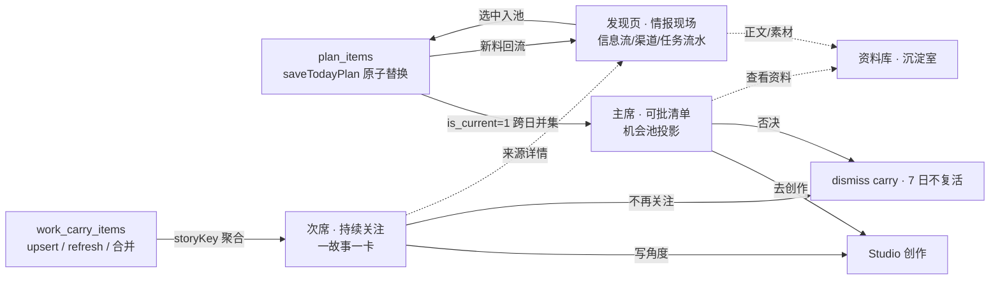
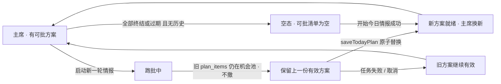

# 今日页重设计：主编办公台（北极星修订版）

日期：2026-08-06 ｜ 作者：DeskDesigner ｜ 状态：设计定稿（可指导工程，待 Owner 确认实施）

**取代关系**：本文为北极星修订版，取代 `.ai/2026-08-06-fermenting-rail-redesign.md` 的主导地位。原稿的工程事实（carry 状态机、fingerprint 字面分叉、aftershock 依赖 topicId、mergeSimilarCarryItems 未提交补丁、机会池投影）继续复用；文档结构、信息架构、对外文案与验收标准以本稿为准。

---

## 0. 结论先行

1. **今日页 = 主编办公台**：主席永远是「当前可批的选题/方案」，次席是「持续关注」，资料、进度、渠道流水一律降级或外链发现页。
2. 机会判断三件事各归其位：**现在写什么** → 主席可批清单；**为什么还值得盯** → 次席持续关注；**怎么做** → 卡上建议动作 + 去创作。
3. **「持续关注」≠ 未消化 backlog**：一故事一卡（storyKey），卡必答「为何关注」；无后续影响证据的旧机会打「待处理」标签留在机会池，不进 rail。
4. **跑批中/partial 不撤旧方案**：主席投影源 = 机会池（跨日 `is_current=1` 未终结项）＞ 最近有效 plan ＞ 空态；新方案就绪由 `saveTodayPlan` 原子替换，空态仅当历史上从未有可批项。
5. **文案统一「持续关注 / 待处理 / 观察中」**，全文无「仍在发酵」，无主标题+副标题。MVP 只动展示层 + 故事身份聚合，1–2 天可交付。

---

## 1. 北极星（Owner 锁定，违反即失败）

> **今日页 = 主编办公台。不是情报任务状态页，也不是资料堆。**

| 角色 | 是谁 | 职责 |
|---|---|---|
| 用户 | 主编 | 取舍与拍板：现在写什么、为什么、怎么做 |
| AI | 编辑 | 把当下最值得做的选题/运营方案递上桌 |

| 页面 | 定位 | 用户第一眼应看到 |
|---|---|---|
| **今日** | 主编办公台 | 当前可批的选题/方案（机会判断主视野） |
| **发现** | 情报现场 | 信息流、新料、渠道/任务流水与扫描状态 |
| **资料库** | 有价值内容沉淀室 | 需要时再查；不是日常第一落点 |

**硬约束（违反即设计失败）：**

1. 今日第一眼必须始终能看到「当前可批的选题/方案」。
2. 新一轮情报或方案未生成完成时，**不得撤掉旧方案变成空态**。
3. `partial` / 任务进度 / 扫描流水 **不得占掉今日主视野**；任务状态叙事归发现侧。
4. 今日只服务机会判断：现在写什么、为什么、怎么做。资料列表、渠道就绪、跑批进度均降级为次要或外链到发现。

本方案的一切细节（IA、对象、刷新语义、持续关注规则、验收）都是上述北极星的投影；北极星是判据，不是附录。

---

## 2. 主编的一天 → 今日页 IA（上 → 下）

### 2.1 从工作流倒推

主编的一天（情报驱动内容生产者）：

1. 早上打开今日 → **看今天有什么可拍板的选题/方案**（主席）
2. 拍板：采纳 → 去创作；否决 → 该机会终结
3. 扫一眼「还有什么事件仍在演化、值得继续跟」（次席）
4. 需要细节/素材 → 发现页查流水、资料库查正文
5. 跑批进行中 → **不离开办公台**：进度只占命令条一行，主视野仍是上一份有效方案

### 2.2 今日页信息架构（上 → 下）

| 层级 | 区块 | 内容 | 规则 |
|---|---|---|---|
| **主席** | 当前可批清单 | 机会池投影的 Opportunity 卡（优先级、时效、为何现在写、建议动作） | **永远在**：跑批中/partial 保留上一份有效方案；空态仅当从未有可批项（见 §4） |
| **次席** | 持续关注 | 按 storyKey 聚合的一故事一卡（为何关注/已关注天数/最新进展/建议动作） | 服务「还值得盯吗」；一故事一卡；观察中折叠（见 §5） |
| **降级** | 命令条 + 右侧栏 | 一行进度（`TodayRunView` 投影）、blockers、今日入库资料 feed | 进度/partial 文案不得替换主席清单；任务流水详情外链发现页 |
| **空态** | （仅真正无历史时） | 「点开始今日情报」 | 不得伪造「今日方案尚未生成」占位卡 |

### 2.3 主编办公台信息流



**边界判据一句话**：「现在可批」占主席；「还值得盯」进持续关注；「值得写但没写」进待处理；任务流水去发现。

---

## 3. 对象模型（人类编辑心智 = 系统对象）

| 对象 | 定义 | 所在区 | 关键规则 |
|---|---|---|---|
| **可批方案（Opportunity）** | 今天可以落笔、可以拍板的选题/运营方案，含 whyNow/angle/建议动作 | 主席清单 | 来源 = `plan_items`（`is_current=1` 跨日并集）投影为机会池；终结 = 采纳（有项目）/ 否决（dismiss carry）/ 超时效窗口（爆点 24h / 热点 72h / 长青不过期） |
| **Story（事件卡）** | 一个仍在演化、仍有后续影响的事件（如「英国移民规则 HC 259 更新」） | 次席持续关注 | 稳定身份 storyKey；标题取最新措辞，身份不变；是 rail 的最小展示单元 |
| **Opportunity ↔ Story 附着** | 可写角度附着在事件上 | 主席卡 / 次席卡共用「去创作」 | 一 Story 当前至多一个主角度；**同一 Story 不得在主席清单分裂成多行**（见 §3.1） |
| **待处理** | 被评估过值得写、但今天没写成的旧机会（跨日未终结项） | 机会池（主席清单内打标签） | 与持续关注**分轨**：无后续影响证据的旧机会一律只在此处；带「待处理」标签，明确非今日递案 |
| **归档** | 已采纳 / 已否决 / 已过期 | 历史（库内可查） | 不自动复活；仅编辑显式恢复 |

### 3.1 禁止事项（backlog 不得冒充）

- **backlog 不得冒充可批**：待处理项必须带「待处理」标签（`planDate < today` 的 pool 项），与今日递案视觉区分；主席清单不允许出现"看起来是编辑今日推荐、实际是未消化堆积"的卡。
- **backlog 不得冒充持续关注**：无 aftershock 且无「未完结影响」标记的旧行，只在机会池打「待处理」，不进 rail。
- **相似题不得并排**：同一 Story 的主角度在主席清单只留一张卡（storyKey 去重，最高优先级项作主角度，其余折进卡内或回落待处理）；在 rail 一故事一卡。

---

## 4. 主席：方案保留 / 替换语义（硬约束 1、2 的落地）

### 4.1 投影源优先级（确定性系统行为）

```
主席清单 = 机会池（getOpportunityPool，is_current=1 跨日未终结项）
         ＞ 最近有效 plan 的未过期项（兜底投影，机会池为空时）
         ＞ 空态（仅当历史上从未有可批项，或全部已终结/过期）
```

现状事实：`getToday()` 的 pool 不依赖「今日 plan 已生成」，跑批中旧 plan 的 items 仍在池内；`displayItems = pool ? pool.map(poolItemToPlanItem) : ...` 的 JS 真值判断使空数组也会压过兜底——**必须改为显式判空**：pool 非空用 pool，pool 空但存在未终结旧 plan 项时回退投影，两者皆空才空态。

### 4.2 保留 / 替换规则

1. **跑批中（running/starting/scanning/judging）**：旧方案不动。机会池照常返回，主席清单保持；命令条显示一行进度（`deriveTodayRunView` 投影），**进度文案不得替换清单**。
2. **partial**：资料已入库、方案未生成完——主席仍显示上一份有效方案；主 CTA 是「继续生成方案」（沿用既有语义），不引导"手写方案"，更不把旧方案撤成空态。
3. **新方案就绪**：`saveTodayPlan` 事务内原子替换（同日旧 plan `is_current=0` → 新 plan `is_current=1`），pool 自动换新；同 topicId 的旧行走 carry upsert/终结，无需 UI 手动切换。
4. **任务失败/取消**：旧方案继续有效（`is_current=1` 未变），主席不清空。
5. **空态定义**：仅当 `pool 为空 且 无任何未终结 plan 历史`。空态文案只指路「点开始今日情报」，禁止伪造「今日方案尚未生成」占位卡（与 spark 主线路设计一致：`pendingActions` 不得因缺 plan 生成人工待办）。

### 4.3 保留 / 替换状态机



---

## 5. 次席：「持续关注」完整规则

### 5.1 入池 / 出池（四阶段派生，复用现有 carry 五态）

现有 `CarryState = active | watching | done | dismissed | expired` 保留不删，stage 由 refresh 派生：

| 阶段 | 现有 state 映射 | 入池充要条件 | 出池充要条件 |
|---|---|---|---|
| **emerging 新起（仅观察）** | active（无余波） | 同一故事规则下无现存活跃卡（新建） | → fermenting：出现 ≥1 条新证据（aftershock≥1）或编辑「继续关注」；→ closed：48h 无新证据且无未完结影响 |
| **fermenting 持续关注** | active（有余波） | **同一 story 的 firstSeenAt 之后出现 ≥1 条新来源/新进展（aftershock≥1）**，或编辑手动「继续关注」 | → cooling：连续 2 天无新证据且未采纳；→ closed：采纳写角度（done）、dismiss、或关注满 14 天无采纳 |
| **cooling 观察中** | watching | 从 fermenting 退出且无新证据 ≥2 天 | → fermenting：又有新证据（回热）；→ closed：冷却满 7 天无回热（自动 expired 语义）或 dismiss |
| **closed 终态** | done / dismissed / expired | 采纳、否决、超时 | 不自动复活；仅编辑显式恢复可回 fermenting |

> 工程语义：fermenting 与 emerging 的区分在 refresh 时派生（`aftershock_json` 非空 → fermenting），MVP 无需加列；完整版加 `stage` 列固化，避免 refresh 时序依赖（`db/late-migrations.ts`）。

### 5.2 一故事一卡 + storyKey

**storyKey 判定规则（确定性，优先级递进，命中即同一 Story）：**

1. **topicId 优先**：`topic_id` 非空且相同 → 同一 story（复用 `work_carry_items.topic_id` 索引）。
2. **来源核心集**：共享 ≥2 个来源或来源 Jaccard ≥ 0.5（复用现有 `mergeSimilarCarryItems` 判据）→ 同一 story。
3. **规范化标题关键词**：`normalizeTitle`（NFKC + 去空白 + 小写）之上，去时态/修饰词（更新、再发、最新、又、疑似、通报…）后做关键词 bigram 集合，重合 ≥ 0.5 → 同一 story。
4. **fingerprint 降级为兜底**：`fingerprintPlanItem`（normalizeTitle+topicId+sourceIds 的字面哈希）只做今日方案去重（`isCoveredByTodayPlan`、pool 的 carry 查重），**不得做故事身份主键**。

卡面数据规则：标题取最新措辞；`firstSeenAt` 取最早行；aftershocks 按 story 并集；`fermentedDays` 沿用现有计算（最早行日期）。

### 5.3 卡面字段（缺一不可，缺则不出现在此 rail）

| 字段 | 来源 |
|---|---|
| **为何关注** | `aftershocks[0..1].title`（余波/新证据摘要），或「未完结影响」标记（`isMultiDayTimeliness(timeliness)` 或 planning 递案时的语义化 reason，如「政策后续未出」） |
| **已关注 N 天** | `fermentedDays`（沿用现有计算） |
| **最新进展** | 最近一条 aftershock 的日期 + 一句话；无则「暂无新进展」 |
| **建议动作** | 附着的主角度（Opportunity）一行 + 「去创作」按钮（复用 `createProjectFromPlanItem`） |

MVP 无 schema 变更即可取数：`WorkCarryItem.aftershocks` / `fermentedDays` 字段已存在；「未完结影响」先由 planning 递案的 `reason` 语义化承载，完整版落 `unfinishedImpact` 列。

### 5.4 文案（统一说法，无主副标题、无「仍在发酵」）

| 位置 | 文案 |
|---|---|
| rail 标题 | 「持续关注 · N」 |
| 卡面字段 | 为何关注 / 已关注 N 天 / 最新进展 / 建议动作 |
| 空态 | 「没有需要持续关注的事件。」 |
| 降温区 | 「观察中」（watching/cooling 折叠展示，只显计数，不占主列表） |
| 无余波去向 | 机会池标签「待处理」（与持续关注 rail 分家） |

---

## 6. 三页边界与跳转

| 去向 | 谁进 | 规则 |
|---|---|---|
| **今日 · 主席** | 当前可批方案（机会池投影）+ 待处理候补 | 新方案未完成时保留上一份有效方案；空态仅当从未有可批项 |
| **今日 · 次席** | 有余波/未完结影响的 Story | 一故事一卡；服务判断，不替代可批清单 |
| **今日 · 观察中** | emerging（窗口内无余波）、cooling/watching | 折叠区，不占主列表 |
| **今日 · 待处理** | 无余波旧机会（跨日未终结项） | 与持续关注分轨；可批但不是今日递案 |
| **发现页** | 信息流、新料、渠道/任务流水、partial 细节、扫描进度 | 情报现场；任务叙事只在此呈现，不回流占今日主视野 |
| **资料库** | 沉淀后的有价值内容（正文/检索/素材） | 需要时再查，非第一落点 |

**跳转清单**：主席卡「去创作」→ Studio；主席/待处理卡「查看资料」→ 今日右侧 feed（轻量）→ 资料库（完整）；rail 卡来源详情 → 发现页对应来源；命令条进度「详情」展开的诊断 → 发现页任务流水。

---

## 7. 职责分工：Agent（编辑）递案 vs 系统（确定性）

| 事项 | 归属 | 具体职责 |
|---|---|---|
| 递案 | **Agent（编辑）** | 判断哪些机会值得递上桌（priority、whyNow、angle）；**尽力绑定 topic_id**（提升 `plan_items.topic_id` 绑定率是 aftershock 引擎的根因）；timeliness 输出含持续/余波关键词以点亮「未完结影响」；同一故事保持措辞/topicId 稳定 |
| 身份判定 | **系统** | storyKey 按 §5.2 确定性合并；`upsertCarryFromPlanItem` 查重从 fingerprint 精确匹配改为 storyKey 命中 → 更新标题/来源/进展，无命中 → 新建 |
| 状态流转 | **系统** | dismiss 后 7 日内任何重播种/回灌不得复活（现有泊车语义，按 storyKey 扩展）；采纳后转 done 出 rail（事件仍演化可降级观察）；过期/冷却计时 |
| 主席保留/替换 | **系统** | pool 投影 + `saveTodayPlan` 原子替换（§4），不依赖 Agent 文案 |
| 余波计算 | **系统** | `refreshAftershocks`：MVP 维持现状（topicId 命中才查），完整版去 topic 硬依赖（按 storyKey 查新来源） |
| refresh 时序 | **系统** | `refreshWorkCarry` 内**先按 story 聚合/合并，再 refreshAftershocks，再派生 stage**——合并必须在余波刷新之前，否则余波按分裂行各算一遍 |

**禁止**：Agent 直接改 carry 状态；系统在无 plan 时伪造可批占位。

---

## 8. 里程碑：MVP / 完整版 / 迁移 / 风险

### 8.1 MVP（1–2 天：展示层 + 身份聚合，零 schema 变更）

1. **主席保留语义固化**：`displayItems` 显式判空（pool 空回退兜底投影）；跑批中/partial 不撤旧方案（现状已是事实，补回归验收）；待处理项打「待处理」标签。
2. **FermentingRail → 持续关注**：文案替换（rail 标题「持续关注 · N」、aria-label、空态「没有需要持续关注的事件。」）；过滤（仅 aftershock≥1 或未完结标记）；卡面 4 字段（为何关注/天数/最新进展/建议动作）；「观察中」折叠区。
3. **storyKey 合并上线**：提交并改造现有未提交的 `mergeSimilarCarryItems`（判据从纯来源重合升级为 storyKey 规则）；`listFermentingBundle` 输出 story 聚合。
4. **planning 递案语义化**：`saveTodayPlan` 的 carry reason 从「写入今日方案时进入续命池」改为语义化「为何关注」种子（如「未完结影响：政策后续未出」）。
5. **文案清查**：全 UI（含 `pi-dock.tsx` 上下文描述）无「仍在发酵」；无主副标题。

### 8.2 完整版（后续迭代）

- `work_carry_items` 加 `story_key` 列 + 部分唯一索引（`WHERE story_key IS NOT NULL`）、`stage` 列固化 emerging/fermenting/cooling（`db/late-migrations.ts`）
- `refreshAftershocks` 去 topic 硬依赖：按 storyKey 查新来源（无 topic 也可亮后续）
- planning 侧 topic 绑定率提升（Agent prompt + 校验，未命中 topic 走规则 2/3）
- 发现页收编任务叙事：扫描/判断流水、partial 详情只在发现呈现，今日页彻底退出进度叙事
- 机会池增强视图：待处理排序/过滤/批量归档；主角度切换器（同一 Story 换角度不换卡）

### 8.3 迁移（三步走）

1. **展示层先改（MVP 当天）**：rail 只渲染「aftershock≥1 或未完结标记」的卡；标题统一「持续关注」；无余波旧行回落机会池并打「待处理」标签，不硬删数据。
2. **数据合并（MVP 次日）**：按 storyKey 归并现有活跃行——实库「英国移民规则又更新：HC 259」与「移民规则又更新了吗：Statement of…」合为 1 卡（保留最近措辞为标题、最早行日期为 firstSeen）。
3. **无双轨过渡文案**：不写主副标题、不写「事件发酵 · 待消化已移入…」过渡句；说法一步到位统一为「持续关注 / 待处理」。

不写一次性清理脚本（幂等，refresh 即收敛）；历史 dismissed/expired 行不动。

### 8.4 风险与缓解

| 风险 | 缓解 |
|---|---|
| **误合并**：来源重合/标题相似的**不同**事件被并入一卡 | 只合并"活跃同源行"，保留被并行的 dismissed 记录与原因（可查证回滚）；Jaccard 阈值 0.5 起步；误合并可手动拆分 |
| **refresh 时序**：stage 靠派生，refresh 中断短暂分类不一致 | MVP 接受；完整版加列固化 |
| **迁移期观感**：合卡后 rail 卡数变少，用户以为数据丢失 | 机会池「待处理」可见 + 文案统一为「持续关注」，不靠副标题解释 |
| **topic 绑定率低是根因**：余波引擎依赖 topic 语义 | 规则 2/3 是兜底不是终局；规划侧提升绑定率，否则完整版余波质量受限 |
| **主席误清空**：pool 空数组的 JS 真值陷阱 | §4.1 显式判空 + §9 回归验收（跑批中旧方案仍可见） |

---

## 9. 验收标准（可观察、可证伪）

**A. 办公台定位**

1. **主席不空（跑批中旧方案仍可见）**：存在历史有效方案时，启动新一轮情报（running/scanning/judging）及 partial 期间，今日主区仍展示上一份可批清单，不出现「今日方案尚未生成」空主视野（probe：启动跑批 → 断言机会卡仍在）。
2. **进度不夺权**：命令条进度/partial 文案不替换机会列表；主 CTA 区可有轻量状态，但机会卡列表保持可见。
3. **三页分工**：发现页可见情报流/任务流水；资料库不是今日第一落点；今日页无任务流水主栏。

**B. 持续关注**

4. **文案统一**：全 UI grep 无「仍在发酵」；rail 标题为「持续关注 · N」；无主副标题方案。
5. **无余波不进 rail**：rail 卡必有非空「为何关注」；无 aftershock 且无未完结标记的旧行只在「待处理」。
6. **一故事一卡**：移民规则相似卡按 storyKey 聚合后只留 1 卡；同故事改标题保存，carry 行数不增。
7. **采纳/否决**：写成功 → 出 rail 且机会池移除；dismiss → 7 日内不复活。
8. **空态独立**：无持续关注事件时显示「没有需要持续关注的事件。」，此时主席可批清单仍可非空。

**C. 三相似题不并排**

9. **主席去重**：同一 Story 的相似机会（移民规则 / AI 写作）在主席清单只留主角度一张卡，不并排出现 2+ 张。
10. **待处理分流**：无余波旧机会在机会池可见并带「待处理」标签。

---

## 10. 工程落点模块列表（模块名，不写代码）

- `src/main/ferment.ts`：`fingerprintPlanItem`（身份降级为兜底，仅今日方案去重）、`upsertCarryFromPlanItem`（查重改 storyKey + reason 语义化）、`refreshAftershocks`（完整版去 topic 硬依赖）、`mergeSimilarCarryItems`（判据升级为 storyKey 并提交）、`refreshWorkCarry`（先聚合后余波再分类）、`listFermentingBundle`（story 聚合输出 + 持续关注过滤 + 卡面字段投影）
- `src/main/ferment-read.ts`：storyKey 派生（`storyKeyOfPlanItem`：topicId → 来源核心集 → 规范化标题 bigram）、`normalizeStoryTitle`（去时态/修饰词）、`isCoveredByTodayPlan` 配套
- `src/main/workbench.ts`：`getToday`（主席投影显式判空 + 兜底回退）、`getOpportunityPool`（待处理标签数据 + storyKey 去重）
- `src/main/planning.ts`：`saveTodayPlan` 递案 reason 语义化、`topic_id` 绑定率
- `src/renderer/today-view.tsx`：`displayItems` 投影规则（§4.1）、FermentingRail 保持次席位置
- `src/renderer/today-view-panels.tsx`：`FermentingRail` → 「持续关注」+ 卡面 4 字段 + 「观察中」折叠
- `src/renderer/today-pool-view.ts`：`poolBadges` 增加 `pending`（待处理）badge
- `src/renderer/today-run-view.ts` / `today-command-bar.tsx`：进度/partial 只占命令条，不触碰主席
- `src/renderer/pi-dock.tsx`：上下文描述去掉「仍在发酵=未消化续命项」，改为「持续关注 / 可批方案」语义
- `src/renderer/global.d.ts`：`unfinishedImpact`、`latestProgress` 渲染类型（完整版落库列）
- `db/late-migrations.ts`：完整版 `story_key` 部分唯一索引 + `stage` 列
- `styles-workflow-today.css`：rail 次席视觉（不压过主席清单）
- `tests/`：新增 `today-desk-persistence`（跑批中旧方案可见）、`ferment-story-merge`（相似卡聚合、措辞漂移不增行）回归
