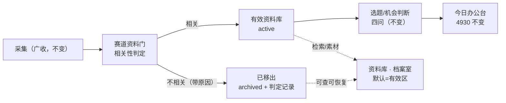

# 赛道资料门设计：入库后的赛道相关性清洗（有效资料库）

日期：2026-08-07 ｜ 作者：LaneGateDesigner ｜ 状态：已锁定（Owner 确认 2026-08-07）

**取代关系**：本文在「采集 → 选题」链路上新增一个**入库后的赛道相关性关卡**，是 WMB-4930（今日主编办公台 MVP）之后的下一里程碑。本文**不重写** 4930 北极星（`.ai/2026-08-06-today-editor-desk-design.md`，锁定）与情报主线（`docs/spark/2026-08-06-today-daily-intelligence-mainline-design.md`），只在其上追加一层清洗。`docs/spark/2026-08-06-intelligence-to-topic-agent-design.md` 中「不做轻筛+完整判断两级模型」一句，针对的是**选题质量**的两级判断，本设计是它之前的**赛道相关性**关卡（Owner 已锁定必须存在），两者不冲突；相关判断被从选题四问中拆出，独立成关。Owner 锁定证据：`TASKS.md` WMB-4940 + `PLAN.md` M-4940。

---

## 1. 北极星一句话 + 页面/角色边界

> **广收进来，先问一句「这是不是本赛道（本工作空间）的有效素材」，不是就带着原因移出有效资料库；剩下的才是选题判断的地基。**

| 角色 | 是谁 | 职责 |
|---|---|---|
| 用户 | 主编 | 拍板赛道边界、审 AI 的判定、恢复误判 |
| AI | 编辑 | 广收后先做赛道相关性判定，不相关的移出有效库并留原因 |

| 页面 | 定位 | 与本文关系 |
|---|---|---|
| **发现** | 情报现场 | 采集流、渠道流水、判定流水（本轮判 N 相关 / M 不相关） |
| **今日** | 主编办公台 | 只吃**有效**资料（今日新资料、机会池、持续关注）；判定流水不占主视野 |
| **资料库** | 档案室 | 默认只陈列**有效**资料；「已移出」视图可查原因、可恢复 |

**硬约束（违反即设计失败）：**

1. 广收（scan-all，REQ-022）保持不变——采集层不引入赛道过滤。
2. 赛道相关性 ≠ 选题价值：不相关 = 不是本赛道的有效素材；选题价值 = 有效素材里今天值不值得写。两者分关，不得在四问里混判。
3. 不相关的资料必须**移出有效资料库**（默认视图/简报增量/今日 feed 不可见），而不是永远堆在有效区里。
4. 移出必须**可追溯**：有原因、有判定人、可恢复；AI 永不硬删。
5. 4930 的全部规则（主席保留/持续关注/待处理）原样保留，本文只做增量。

---

## 2. 问题（现状）

### 2.1 采集全量入库，不做赛道过滤（正确，保留）

X List 与官网渠道的每一条动态都经 `upsertSource` 直接落库（`intelligence-wire.ts` 的 `upsertTimelinePost`、`website-channel.ts`、`x-list-execution.ts`），默认 `management_status='active'`、`verification_status='pending'`。渠道是按赛道启用的（如 AI 工作空间的「AI前沿」List），但**单条内容**不做赛道判定：博主混发生活/泛科技/广告时，这些噪音与 AI 前沿发布同权入库。广收本身是 REQ-022 的正确语义，保留。

### 2.2 判断被压上双重职责（过载）

现状链路：采集 → `assembleEditorialBrief` 增量块（`WHERE collected_at > watermark`，**无管理状态过滤**，`src/main/editorial-brief.ts`）→ 四问选题判断。于是：

1. **四问（为什么是现在/为什么是你/独特说法/证据在哪）被迫兼任「这是不是本赛道素材」**——而四问是为选题质量设计的，赛道边界根本不是它的问题。滚动机会池设计把「不值得进池」收进判断里，等于把相关性静默揉进选题判断；
2. **资料库默认视图只排除 `archived`**（`knowledge.ts`），噪音素材与有效素材同列，档案室被灌水；`searchSources` 甚至不过滤 archived；
3. **今日 feed 与「今日新资料」统计无管理状态过滤**（`workbench.ts getToday`），噪音也算进主编办公台的数字。

### 2.3 目标管线（清晰分关）



一句话边界：**「是不是本赛道的料」归资料门；「值得不值得写」归四问；「今天写不写」归今日办公台。**

---

## 3. 判定模型：谁判、判什么、放哪

### 3.1 三层判定（hybrid，默认自动）

| 层 | 判定者 | 范围 | 产物 | 成本 |
|---|---|---|---|---|
| **Tier 0 · 确定性规则** | 系统（零模型） | 官方/赛道精选信源（W1 主发清单、AI-only route 索引、按 `intelligencePackId` 映射的赛道专属渠道） | 直接判相关，不入模型 | 0 |
| **Tier 1 · 编辑判定** | Agent（Pi，与四问同一轮调用） | 其余全部新入库资料 | 二分类 + 原因码 + 一句话 | 单轮内追加，无额外往返 |
| **Tier 2 · 主编覆写** | 主编（UI） | 任何被移出/被保留的资料 | 恢复/标记，写入判定记录 | 人工 |

默认自动化 = Tier 0 + Tier 1 全自动；Tier 2 是逃生口，不是流程必经。

### 3.2 判定内容（Tier 1 的输入输出）

**输入**：每条新入库资料的 `id / title / summary / author / canonicalUrl / categories` + 工作空间身份（`intelligencePackId` 即赛道：AI = `wemedia-intelligence-engine`，UK = `uk-life-content-radar`，游戏 = `game-news-radar`；加上 audience/contentGoal/editorialBrief 作为赛道边界描述）。

**输出**（结构化 JSON，复用 WMB-4917 的 `parseDailyPlanOutput` 严格解析模式）：

```json
{
  "gate": [
    { "sourceId": "…", "relevant": true },
    { "sourceId": "…", "relevant": false,
      "reasonCode": "lifestyle_noise",
      "reason": "博主个人生活动态，与 AI 赛道无关" }
  ]
}
```

**reason_code 词典（MVP）**：`off_lane_content`（赛道外内容）、`lifestyle_noise`（混发生活/个人化）、`ad_promotion`（广告/营销）、`out_of_scope_region`（区域/人群不符）、`duplicate_series`（同主题流水账续贴，无增量信息）、`edge_ai_adjacent`（边缘沾边，AI 判不相关但存疑）、`official_source`（Tier 0 规则产物，仅记录不判定）、`editor_override`（Tier 2 主编覆写）。完整版可扩。

**判定失败的语义（fail-closed on archive）**：结构化输出解析失败或 Pi 不可用 → **不归档任何条目**、水印不推进，下一轮整批重判（判定幂等，见 §5）。宁可多留一轮，不可静默误归档。

### 3.3 状态/对象模型（复用优先，最小新增）

复用 `source_items.management_status`，新增一张判定流水表。**不新增 CHECK 枚举值（MVP）**——理由见 §3.4。

| 对象 | 落点 | 说明 |
|---|---|---|
| **相关** | `management_status` 保持 `active`（或主编手设 `watching`） | 进有效资料库；`verification_status` 正交不动（待核验规则照旧） |
| **不相关（AI 判定）** | `management_status='archived'` + 判定流水行 | `archived` 是所有默认视图既有的排除钩子（ferment / knowledge 默认过滤 / 知识上下文），复用即全链路生效 |
| **不相关（主编覆写恢复）** | 置回 `active`，追加判定流水行（judged_by=editor） | 恢复后 7 日内同 source_id 不再重判（泊车语义，与 dismiss 7 日一致） |
| **硬删除** | 仅主编经既有 `deleteKnowledgeSource` | AI 永不硬删 |
| **判定流水 `source_lane_judgments`** | 新表（追加型） | 见下 |

**新表 `source_lane_judgments`（MVP 唯一 schema 新增，纯追加）**：

```text
id              TEXT PK
source_id       TEXT NOT NULL          -- FK source_items.id
workspace_lane  TEXT NOT NULL          -- 判定时 intelligencePackId 快照
decision        TEXT CHECK IN ('relevant','irrelevant')
reason_code     TEXT NOT NULL          -- §3.2 词典
reason          TEXT                   -- 一句话原因（irrelevant 必填）
judged_by       TEXT CHECK IN ('system','agent','editor')
confidence      REAL                   -- 完整版使用；MVP 允许 NULL
source_revision INTEGER NOT NULL       -- 判定时的 source_items.revision（乐观并发/审计）
judged_at       TEXT NOT NULL
```

追加型：覆写不删旧行，当前判定 = 该 source_id 最新一行。判定流水经既有 dispatcher（CommandEnvelopeV1 + CommandReceiptV1，WMB-4804/4807 模式）写入，同任务/工作空间/租约校验，重放幂等。

### 3.4 为什么 MVP 不新增 `management_status` 枚举值

- SQLite 无法 ALTER CHECK 约束，加枚举值需整表重建迁移；MVP 希望 1–2 天交付、不压 4930 交付节奏。
- `archived` 在所有消费端（ferment 快照、资料库默认、知识上下文、简报增量）已是「移出有效区」的标准钩子，复用即全链路正确，改动面最小。
- 语义混淆（AI 移出 vs 主编归档）在 MVP 由 **UI 原因徽标** 承担（§6.2「已移出」视图区分 `AI 判定不相关：{reason}` 与 `主编归档`），并靠 7 日冷却 + 可恢复兜底。
- **完整版**再落 `management_status='filtered'`（late-migration 重建 CHECK），数据层彻底分家：AI 过滤 ≠ 主编归档。此为唯一被推迟的「新状态」论证——因为它在数据层是**审计可读性**而非**行为正确性**需求，MVP 用判定流水表 + 徽标已满足行为与追溯。

### 3.5 三词定义（避免语义漂移）

| 词 | 定义 | 系统动作 |
|---|---|---|
| **排除 exclude** | 查询瞬间不显示（不持久） | 只作查询前置条件，从不单独作为处置 |
| **移出 archive** | 持久、可追溯、可恢复的处置 | `archived` + 判定流水；默认视图不可见；「已移出」视图可见 |
| **丢弃 discard/硬删** | 不可恢复 | 仅主编显式删除；AI 不触发 |

Owner 契约「不相关项必须丢弃/移出有效库，而非永远堆着」→ MVP 落地为**移出**（可追溯的处置），硬删留给主编。

---

## 4. 交互契约（与既有对象/页面的关系）

| 对象 | 关系 | 规则 |
|---|---|---|
| **编辑简报（`assembleEditorialBrief`）** | 增量块只读**有效**资料 | 增量查询追加 `management_status != 'archived'`；简报追加一行透明计数：「本轮另判 N 条与本赛道无关（原因码前 3 类）」，帮助编辑自审，不占判断主体 |
| **机会池（四问）** | 资料门在其**前**，池规则不动 | 只有相关资料进入四问；「相关但不值得写」留在有效库（资料侧既有的「高价值未创作」视图天然承接），池/plan/carry 零改动 |
| **资料库默认过滤** | 默认 = 有效区 | 默认列表、知识上下文、`wmb_get_knowledge_context` 均不含 archived（既有行为，补回归）；`searchSources` 补默认排除 + 「含已移出」开关 |
| **今日统计「今日新资料」** | 只数**有效**新资料 | `getToday` 的 sources/计数追加 archived 排除；feed 行尾追加「另有 N 条与本赛道无关，已移出有效库」（可点 → 资料库「已移出」视图）。4930 规则不动：此仅为降级区一行计数/文案，不触主席/次席 |
| **持续关注 / 待处理** | 不变量 | carry/pool 照常；若某归档资料已被 carry 引用，carry 数据不动，仅资料卡显示「来源已移出」徽标（展示层，可后置） |
| **渠道与扫描** | 不变量 | 判定结果**不得**自动禁用渠道（REQ-022 scan-all 保留）；每渠道噪音统计进设置页建议（完整版） |

---

## 5. 何时运行

- **触发**：沿用 4930 链路中「每轮采集完成且有新入库 → 自动触发」的判定编排（trigger 甲，WMB-4913）。资料门是**同一轮判断任务的第一关**：Tier 1 先判相关性（含 Tier 0 预筛），再对相关子集跑四问。零额外往返、零额外任务。
- **水印**：MVP 复用 `checkpoint.judgeWatermark`——两关都成功才推进水印；任一关失败则不推进，下一轮整批重判。判定幂等：`source_lane_judgments` 按 source_id+judged_at 去重，重复执行不产生重复行。
- **幂等性证明**：重判时已 archived 的条目直接命中既有状态（status 已是 archived），Tier 0/1 结果一致则零写；分歧（如模型漂移）以最新行覆盖记录但**不反复翻转**——7 日内已判条目不重判（与主编覆写同一冷却）。
- **完整版**：拆 `laneGateWatermark` / `judgeWatermark` 双水印，使判定关与选题关失败解耦。

---

## 6. 展示与文案（Owner 语言）

| 位置 | 文案 |
|---|---|
| 判定流水（发现页） | 「本轮扫描：N 条相关入有效库，M 条与本赛道无关已移出」 |
| 资料库「已移出」视图 | 徽标：`AI 判定不相关：{reason}` / `主编归档` / `已过期`；行内按钮「恢复」（→ 有效区） |
| 恢复确认 | 「恢复后该资料回到有效资料库，7 天内不会再被自动判定」 |
| 今日 feed 行尾 | 「另有 N 条与本赛道无关，已移出有效库」→ 跳资料库「已移出」 |
| 恢复后资料 | 正常出现在有效库；若在增量窗口内，下一轮判断自然可见 |

---

## 7. 非目标

1. 不改采集：scan-all、渠道模块、逐来源回执（REQ-020/021/022）全部原样。
2. 不改选题/机会判断：四问、机会池、carry 状态机、plan_items 结构、4930 主席/次席规则全部原样。
3. 不做跨赛道搬运：被移出的资料留在本根（REQ-017 根隔离），不自动路由到其它工作空间。
4. AI 不硬删、不整号拉黑（作者级 blocklist 不做）；渠道不因判定结果自动启停。
5. 不做相关性打分/推荐引擎；MVP 只做二分类 + 原因。不做模型训练；反馈只以提示词少量示例体现（完整版）。
6. 不改发布链路、precise grants、浏览器绑定、Studio/Results schema（契约约定）。

---

## 8. 里程碑：MVP vs 完整版（并行轨道 M-4940，不阻塞 4930）

### 8.1 MVP（M-4940，建议在 4930 合并后或并行实施；1–2 天）

| WMB | 交付 | 验收 |
|---|---|---|
| **WMB-4941** | 判定数据契约：`source_lane_judgments` 表 + dispatcher 业务命令 `sources.lane_gate` / `sources.lane_restore`（CommandEnvelopeV1 + 回执，重放/冲突/陈旧零写）+ judge intent 的 task grant 挂载 | fixture：判定行写入/重放/冲突读回；陈旧 revision 零写 |
| **WMB-4942** | 判定两关落地：Tier 0 规则（官方/赛道精选信源直判相关，不入模型）+ Tier 1 prompt 第一关（相关性二分类 + 原因码，结构化 JSON 严格解析）+ 归档写路径（`archived` + 流水行） | fixture：混合批（AI 发布 + 生活动态 + 官方发布）→ 生活动态 archived 带原因，官方与 AI 发布保持 active；解析失败零归档 |
| **WMB-4943** | 有效库管线：简报增量过滤 archived + 透明计数行；今日 feed/「今日新资料」只数有效 + 行尾计数；ferment/knowledge 既有过滤补回归；`searchSources` 默认排除 + 开关 | fixture：`assembleEditorialBrief` 增量不含归档项；`getToday` 计数只数有效；feed 行尾计数正确 |
| **WMB-4944** | 资料库「已移出」视图：原因徽标、恢复按钮（置回 active + 流水行 + 7 日冷却不重判） | fixture：恢复 → 有效库可见 + 下一轮增量可见；7 日内同 source_id 不重判；流水含 editor 覆写行 |
| **WMB-4945** | 端到端验收：真实混合扫描一轮，读回判定行/统计/徽标/恢复闭环；4930 回归（pool、rail 测试原样通过） | 见 §9 A–E |

### 8.2 完整版（后续迭代）

- `management_status` 增 `'filtered'`（late-migrations 重建 CHECK）：AI 过滤与主编归档在数据层分家。
- 双水印 `laneGateWatermark` / `judgeWatermark`：两关失败解耦。
- `confidence` 列 + 「存疑」桶：低置信/`edge_ai_adjacent` 入主编待审队列而非直接归档。
- 提示词级反馈：主编恢复/保留历史作 few-shot 示例，提升精度（有上限，不做自动学习）。
- 每渠道噪音统计 + 设置页建议（建议不自动改，REQ-022 保留）。
- 「已移出」批量视图：按日期/原因码筛选、批量恢复。

---

## 9. 验收标准（可观察、可证伪）

**A. 判定正确性**
1. 混合 fixture（赛道发布 + 博主生活动态 + 官方信源发布）跑一轮判定：生活动态 → `archived` + `reason_code=lifestyle_noise` + reason 非空；官方信源 → 保持 active 且**无模型调用痕迹**（Tier 0 命中）；赛道发布 → active。判定流水行含 judged_by / judged_at / source_revision。
2. 结构化输出损坏或 Pi 不可用时：**零归档**，水印不推进，下一轮重判（幂等，无重复流水行）。

**B. 有效库分离**
3. 归档项从默认资料库列表、`wmb_get_knowledge_context`、简报增量块、今日 feed 全部消失；「已移出」视图可见且带原因。
4. 「今日新资料」只数有效项；feed 行尾显示「另有 N 条与本赛道无关」。
5. `searchSources` 默认不含归档项，勾选「含已移出」后可见。

**C. 主编覆写闭环**
6. 恢复 → 资料回有效库，下一轮简报增量可见；流水新增 `judged_by=editor` 行；7 日内同 source_id 不被重判（即使被渠道重采）。

**D. 4930 完整性**
7. plan_items / carry / 机会池零 schema 变更；既有 pool、持续关注、主席保留测试原样通过；今日主席/次席行为与 4930 设计逐条一致。

**E. 空跑不变**
8. 零更新/空方案成功路径（AC-017）不受影响：无新入库时资料门 no-op，判定任务照常收尾。

---

## 10. 风险与缓解

| 风险 | 缓解 |
|---|---|
| **误归档边缘 AI 沾边内容**（如「AI 数据标注公司融资」） | 判定必须带原因；归档可恢复 + 7 日冷却；完整版低置信入「存疑」桶交主编而非自动归档；Tier 0 精选信源永不误伤 |
| **X 混发噪音灌水** | 逐条内容判定（不做作者整号拉黑）；每渠道噪音统计仅作设置页建议；渠道启停仍由主编在设置操作 |
| **成本** | 资料门与四问同一轮调用，零额外往返；Tier 0 免模型；二分类+原因极简，Flash 单批成本可忽略（对齐滚动池 §8 结论） |
| **弱模型判定质量** | 二分类远简单于四问；严格 JSON 解析（WMB-4917 已验证模式）；解析失败 fail-closed 零归档并下轮重试，绝无静默误归档 |
| **`archived` 语义混用（AI 移出 vs 主编归档）** | MVP 用徽标 + 判定流水区分（§3.4）；完整版落 `filtered` 枚举彻底分家 |
| **水印耦合（判定关拖死选题关）** | MVP 同一轮同水印，失败整轮重试（判定幂等，成本可忽略）；完整版双水印解耦 |
| **恢复后又被重判（与主编意图打架）** | 7 日冷却；覆写为显式人类意图，冷却期满前绝不覆盖 |
| **与 4930 交付冲突** | 独立并行轨道 M-4940；只触 source_items / 资料库 / 简报增量 / 今日 feed 计数，plan/carry/pool 零触碰；§9-D 回归兜底 |
| **反馈回路过拟合（模型学主编恢复模式）** | MVP 无自动学习；完整版 few-shot 示例有上限、人工审阅后才进提示词 |

---

## 11. 工程落点模块清单（模块名/符号，不写代码）

- `src/main/lane-gate.ts`（新增）：Tier 0 规则（官方信源索引/渠道-赛道映射，复用 `workspace-profiles.ts` 的 `intelligencePackId` 与 AI-only route 索引）、`runLaneGate`、判定写路径、`readLaneJudgments`、`restoreFilteredSource`（7 日冷却）、reason_code 词典。
- `src/main/source-commands.ts` / dispatcher（新增命令）：`sources.lane_gate`、`sources.lane_restore`，走 CommandEnvelopeV1 + CommandReceiptV1（WMB-4804/4807 模式），挂 judge/editor intent 的 task grant（`src/main/task-grants.ts`）。
- `src/main/agent-runner.ts`：`dailyPrompt` 加「第一关：赛道相关性」指令段；判定输出并入 `parseDailyPlanOutput` 类严格解析；水印推进改为两关全成（`checkpoint.judgeWatermark`）。
- `src/main/editorial-brief.ts`：增量查询追加 `management_status != 'archived'`；简报追加「本轮判 N 条不相关」透明行（`renderEditorialBrief`）。
- `src/main/workbench.ts`：`getToday` 的 sources/计数过滤 archived；feed 行尾「另有 N 条」计数。
- `src/main/knowledge.ts`：`searchSources` 默认排除 archived + `includeArchived` 开关；`listKnowledgeSources` 补 `source_lane_judgments` 原因 join（徽标数据源）；恢复复用 `updateKnowledgeSource`。
- `db/late-migrations.ts`（或独立 lane 迁移）：MVP 建 `source_lane_judgments`；完整版重建 `management_status` CHECK 增 `'filtered'`。
- `src/renderer/library-view.tsx` / `library-view-parts.ts`：「已移出」视图、原因徽标、恢复按钮、含已移出开关。
- `src/renderer/today-view.tsx` / `today-run-view.ts`：今日新资料口径 + feed 行尾文案（纯展示增量，不触 4930 主席/次席）。
- `src/renderer/discover-view.tsx`（如有判定流水入口）：扫描后一行判定摘要（可后置）。
- `tests/`：`lane-gate-tier0`（官方信源免模型）、`lane-gate-mixed-batch`（相关/不相关分流 + 解析失败零归档）、`lane-gate-restore-cooldown`（恢复 + 7 日不重判）、`brief-increment-effective-only`、`today-stats-effective-only`、4930 回归（pool/rail 原测试不变量）。
