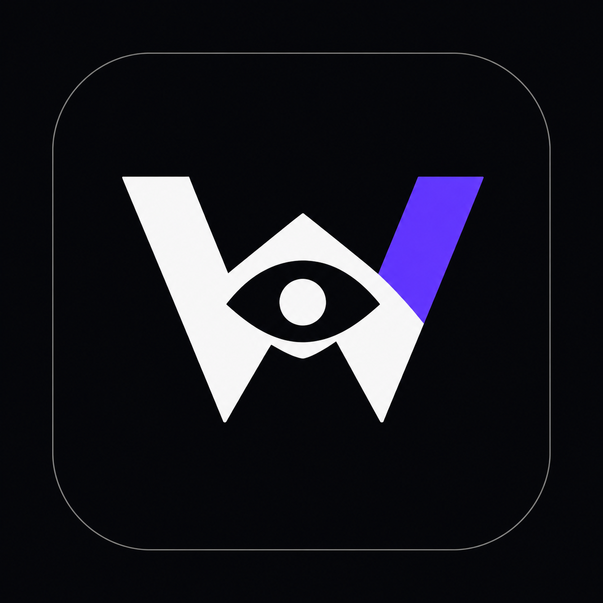

<div align="center">
  
  <h1>WeMediaBuddy</h1>
  <h2>一个终端，跑通自媒体从发现到复盘的完整闭环</h2>
  <p><strong>找资讯、管资料、用 AI、定选题、写内容、适配平台、追结果，不再散落在一堆互不相通的工具里。</strong></p>
  <p>少切换、少搬运、上下文不断线；Agent 负责主路径生产，你负责方向、批准与最终签发。</p>
  <p>
    <a href="https://github.com/PigeonAI-Yang/wemediabuddy/releases/latest">下载 Windows 体验版</a>
    · <a href="https://github.com/PigeonAI-Yang/wemediabuddy/releases/tag/v0.2.1">查看最新版本</a>
    · <a href="https://github.com/PigeonAI-Yang/wemediabuddy/issues">反馈问题</a>
  </p>
</div>

---

## 你缺的不是更多工具，而是一条不断裂的工作链

很多人已经在用 AI 做自媒体，却仍然被一套“散装工作流”拖慢：

- 去 X、新闻站、GitHub 和不同社区找资讯；
- 把值得保留的东西摘进 Obsidian；
- 再打开 Codex Desktop、ChatGPT 或其他 Agent，把背景重新讲一遍；
- 把选题、任务和进度搬到飞书；
- 去不同文档里改稿，再分别准备各平台版本；
- 发布后另建表格记录链接和数据。

每个工具单独看都能用，但它们之间没有同一份业务上下文。最后真正充当“系统”的是你自己：不停复制、粘贴、解释、命名、找文件、对版本、补链接。工具越多，切换成本越高；信息越多，真正用于判断和创作的时间反而越少。

**自媒体真正需要的是敏捷，不是软件考古。**

WeMediaBuddy 要解决的正是这件事。它不是再往工具箱里塞一个 AI 应用，而是把自媒体经营需要的资料、主题、选题、任务、草稿、平台版本、发布结果和复盘放进同一个 Windows 工作终端，让工作从头到尾沿着一条链自然流动。

> **一次发现，持续流转；一次判断，全程可追溯；一次创作，进入下一轮增长。**

```text
多源情报发现
  → 资料自动进入同一现场
  → Agent 整理、归主题、判断机会
  → 形成可批准的选题呈报
  → Agent 起草并准备多平台版本
  → 人工确认发布
  → 回收结果与复盘
  → 反哺下一轮发现和判断
```

## 一站式，不是把功能堆在一起

### 一个终端承接完整自媒体工作

发现、资料库、主题、选题、创作、发布准备、结果和复盘不再各自为政。你不用先在一个应用收藏，再去另一个应用整理，再向第三个 AI 重新解释。每一步都接着上一步继续工作。

### 一条真正闭合的经营链

普通 AI 工具往往在“生成文字”时开始，也在“生成文字”后结束。WeMediaBuddy 从外部信号开始，一直跟到发布结果；复盘结论再回到下一轮选题。内容不再是一次性输出，而会沉淀成越来越有价值的资料、判断和方法资产。

### 上下文跟着工作走，不靠人肉搬运

资料、主题、选题、观点、草稿、平台版本和结果共享同一份本地业务状态。Agent 知道内容从哪里来、为什么值得做、正在做哪一版、下一步需要什么。你不必每换一个工具就重新粘贴资料和复述背景。

### Agent 真正进入生产主路径

记者负责侦察，策划负责判断与呈报，写手负责创作，资料员负责整理，桌助负责承接你的要求。Agent 不是悬浮在页面旁边等你喂提示词，而是围绕同一套业务对象持续干活；你从流程搬运工回到主编位置。

### 为敏捷而设计，而不是为管理而管理

热点有窗口期。WeMediaBuddy 把“发现了什么”“为什么值得做”“应该怎么讲”和“现在做到哪一步”放在同一个工作现场，减少找文件、对版本和同步状态的时间，让创作者更快从信号抵达可发布内容。

### 本地优先，决定权始终在人

业务数据、模型配置和平台登录态保存在本机。Agent 可以完成采集、整理、判断和创作准备，但不会替你点击平台的最终发布按钮。效率可以交给系统，方向、授权、签发和责任仍然属于你。

## 一套散装工具，和一个完整闭环

| 工作环节 | 常见的散装工作流 | WeMediaBuddy 的方式 |
|---|---|---|
| 找资讯 | 在多个平台来回搜索，靠浏览器标签页维持记忆 | 多源信号进入统一发现与资料现场 |
| 做笔记 | 手动摘录到 Obsidian，再自行建立链接 | 来源、资料、主题和选题按业务关系持续连接 |
| 用 AI | 打开 Codex Desktop 或聊天工具，反复粘贴背景 | 内置 Pi 与获得授权的外部 Agent 共享当前业务状态 |
| 管任务 | 把选题和进度再搬到飞书或表格 | 呈报、批准、派工、进度和阻塞留在同一工作链 |
| 写内容 | 资料、观点和草稿散落在不同文档 | 从证据到核心内容保持可追溯 |
| 做多平台 | 复制同一篇稿，再分别手工维护版本 | 核心内容与 X、小红书、微信公众号版本关联管理 |
| 看结果 | 发布后另存链接、另做数据表 | 公开链接、可见指标和复盘回到原来的内容资产 |

WeMediaBuddy 不是要否定 Obsidian、Codex 或飞书。它解决的是另一件事：**当你的目标是高效经营自媒体时，不必再用这些通用工具手工拼出一套内容操作系统。**

## 从一条线索，到下一轮增长

### 1. 发现：把外部世界接进来

从新闻、产品发布、开源项目、Skill、社区讨论和个人实践中发现信号，保存原始来源，而不是只留下一条失去上下文的收藏。

### 2. 沉淀：资料自动进入同一个现场

Agent 整理资料、识别关联并归入长期主题。后续判断、选题和创作都沿用这份上下文，不再重复搬运。

### 3. 判断：把资讯变成可批的机会

热点不等于选题。WeMediaBuddy 将来源、时效、受众、角度、理由和可用材料组织成选题呈报，优先回答“今天什么值得做、为什么、应该怎么讲”。

### 4. 创作：围绕批准后的方向开工

批准选题后，Agent 基于同一份证据和判断起草内容、接受纠偏，并准备不同平台版本。你不必重新开聊天、重新贴材料、重新解释目标。

### 5. 发布：快速抵达平台，但保留人工终审

WeMediaBuddy 准备发布内容、素材和工作现场；最终发布由你在平台页面确认。既缩短路径，也不把账号责任交给全自动机器。

### 6. 复盘：让结果回到下一次决策

回填公开链接、采集网页可见指标并形成 Keep、Stop、Change。上一轮留下的资料、判断和方法，会直接提升下一轮的速度和质量。

## 适合谁

- 每天在资讯平台、Obsidian、AI Desktop、飞书和内容平台之间反复切换的人；
- 经营个人 IP、知识账号或专业内容品牌的创作者；
- 已经在使用 AI，却仍被找资料、搬上下文、定选题和对版本拖住的人；
- 同时维护多个平台，但不想把同一篇稿机械复制三遍的人；
- 希望建立长期内容资产，而不是每天生产一次性文字的人；
- 重视证据、可追溯性和人工终审，不愿把账号交给全自动发布机器的人。

如果你只需要偶尔生成一篇文章，一个聊天框已经足够。WeMediaBuddy 服务的是另一类需求：**持续、敏捷、成体系地经营自媒体。**

## 立即体验

### 系统要求

- Windows 10 或 Windows 11；
- 64 位系统；
- 一个由你自己提供的 OpenAI-compatible 模型服务；
- 对应的 API 地址、API Key 和模型名称。

普通用户不需要安装 Git、Node.js 或 npm。

### 下载与安装

1. 打开 [WeMediaBuddy 最新 Release](https://github.com/PigeonAI-Yang/wemediabuddy/releases/latest)；
2. 展开 **Assets**；
3. 下载 **`WeMediaBuddy.Setup.exe`**；
4. 双击安装并启动应用；
5. 按首次启动向导创建工作空间、配置模型连接；
6. 小红书、X、微信公众号登录可以按需完成，也可以先跳过。

`RELEASES` 与 `.nupkg` 是安装和更新系统使用的文件，普通用户无需下载。

### 关于 Windows 的“未知发布者”提示

当前 v0.2.1 是未购买商业 Authenticode 证书的早期体验版。Windows 可能显示 Microsoft Defender SmartScreen 提示。

请只从本仓库的 [官方 GitHub Release](https://github.com/PigeonAI-Yang/wemediabuddy/releases/tag/v0.2.1) 下载。确认来源后，可在提示窗口点击：

```text
更多信息 → 仍要运行
```

“未知发布者”表示安装包没有商业身份签名，不等同于 Windows 已检测到恶意软件。v0.2.1 安装包的 SHA-256：

```text
ace65c9b94cd558a85ff61eab05be7e2c18966b920a3a78dfc26c95b79d2b902
```

### 首次启动

首次启动向导会依次完成：

1. 创建默认工作空间，或选择现有数据目录；
2. 配置并实际测试 OpenAI-compatible 模型连接；
3. 按需登录内容平台；
4. 进入主界面。

API Key、浏览器登录态和业务数据只应保存在本机，不要提交到仓库或发送给他人。

## 当前版本

最新公开版本：**v0.2.1 Windows 早期体验版**。

当前版本已经提供 Windows 安装器、可续接的首次启动向导、内置精简 Pi 运行时、应用内更新检查，以及更新前任务排空、SQLite checkpoint、配置与数据备份和失败恢复。

项目仍在快速开发中。早期版本可能存在缺陷，部分完整产品闭环仍在持续打磨。请通过 [GitHub Issues](https://github.com/PigeonAI-Yang/wemediabuddy/issues) 提交复现步骤、截图和期望行为。

版本记录见 [`CHANGELOG.md`](./CHANGELOG.md)。

## 数据、安全与边界

- SQLite 业务数据、本地配置、API Key 和平台浏览器登录态保存在用户设备；
- 更新安装前会排空活动任务、执行 SQLite checkpoint，并备份用户数据与配置；
- UI、内置 Pi 与获得授权的外部 Agent 操作同一份本地业务状态；
- Agent 权限受角色能力、任务授权和资源边界共同约束；
- 平台最终发布按钮和硬删除不进入 Agent 自动权限；
- 不要把运行数据、Cookie、API Key 或私密内容提交到公开仓库。

## 从源码运行

开发环境要求：Windows 10/11、Git、Node.js 24、npm 10 或更高版本，以及可用的 Chromium 浏览器。

```powershell
git clone https://github.com/PigeonAI-Yang/wemediabuddy.git
cd wemediabuddy
npm ci
npm start
```

生成 Windows 安装包：

```powershell
npm ci
npm run build
```

构建产物默认输出到当前盘根目录的 `wmb-out`，以避开 Squirrel/NuGet 的 Windows 长路径限制。

## 产品与工程文档

- [`PRODUCT.md`](./PRODUCT.md)：产品形态、用户价值与不可破坏的原则；
- [`PRD.md`](./PRD.md)：产品需求与验收边界；
- [`SPEC.md`](./SPEC.md)：可观察行为与系统契约；
- [`PLAN.md`](./PLAN.md)：交付路线；
- [`TASKS.md`](./TASKS.md)：当前施工台账；
- [`TECHNICAL_DESIGN.md`](./TECHNICAL_DESIGN.md)：技术架构；
- [`DESIGN.md`](./DESIGN.md)：界面设计规范。

## 参与与反馈

WeMediaBuddy 正在寻找真正经营内容的人一起打磨。遇到问题或有明确需求，请提交 [GitHub Issue](https://github.com/PigeonAI-Yang/wemediabuddy/issues)。

反馈时请尽量包含：

- 使用的 WeMediaBuddy 版本；
- Windows 版本；
- 你执行了哪些操作；
- 实际结果与期望结果；
- 可公开的错误信息或截图。

## License

许可证尚未确定。在正式添加许可证前，代码版权归项目作者所有。
