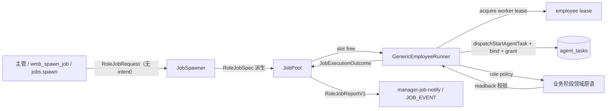

# GenericEmployeeRunner 修复设计（四员工工单统一执行器）

Date: 2026-08-08  
Status: Owner locked 2026-08-08；待后续合同与 TASKS 授权  
范围：reporter / planner / writer / librarian 四角色工单的统一执行器、契约、生命周期、资源竞争、完成读回与干净迁移。只写设计，不写代码。  
Related:

- `docs/spark/2026-08-08-manager-orchestration-design.md`（派工 MCP 面）
- `docs/spark/2026-08-07-role-permission-design.md`（角色授权注册表）
- `docs/spark/2026-08-07-cap027-boundary-test-plan.md`（JobPool L0/L2 边界）
- `docs/spark/2026-08-08-manager-as-primary-agent-design.md`（主管主路径）

---

## 0. 一句话

**四名员工（记者/策划/写手/资料员）的工单由唯一 `GenericEmployeeRunner` 执行：spawn 只按角色派工，intent 由角色注册表唯一派生，资源竞争进入显式 `waiting_resource`，成功必须业务读回验证后才算完成，旧执行器与外部 intent 一次性删除、无 shim。**

---

## 1. 背景与证据

### 1.1 现状拓扑

- `JobSpawner`（`src/main/job-spawner.ts`）是唯一派工入口：JobPool 排队 → employee lease → agent_task → role grant；真实执行由 `options.execute` 注入。
- `execute` 有两处注入点：`ipc-jobs.ts:41` 与 `mcp.ts:391`，都注入 `createDailyJobExecutor`（`src/main/job-execute-daily.ts`）。
- `JobPool`（`src/main/job-pool.ts`）：FIFO 队列 + 槽位晋升（maxWorkers 1..7，`DEFAULT_MAX_WORKERS=2`）+ 实体锁；状态 `queued/running/succeeded/failed/cancelled`；锁键 `planDate:<date>` 与 `projectId:<id>`（`entityLockKeys`）。
- 执行器内部按「intent 或 roleId」分流：`writer/studio_draft` 走 `startStudioDraft`；`reporter/daily_scan` 与 `planner/daily_judge` 走 `startWorkspaceDailyIntelligence(scanOnly/judgeOnly)`。

### 1.2 观察到的失败证据（均为代码可定位事实）

| # | 缺陷 | 证据 |
|---|---|---|
| E1 | **资料员工单必然失败**：`createDailyJobExecutor` 只认 writer 与 scan/judge，librarian（intent=page_library）落入 `unsupported role/intent → return 'failed'` | `job-execute-daily.ts:88-90` |
| E2 | **双入口**：spawner 对非 pipeline intent 先 `dispatchStartAgentTask`+grant，pipeline intent 再由 execute 自建权威 task；同一工单两条建任务路径 | `job-spawner.ts:387-401`（`pipelineOwned`） |
| E3 | **外部 intent 可绕过角色**：`SpawnJobRequest.intent` 由调用方传入，`wmb_spawn_job` 暴露 `intent` 参数；`intent=studio_draft` + 任意 roleId 都会进写手分支；roleId 与 intent 可解耦成错误语义 | `wmb-mcp-tools-manager.ts:44-69`；`job-execute-daily.ts:46` |
| E4 | **planDate 是通用锁**：spawn 预检 + runJob 对所有角色锁 `planDate:<date>`；writer 应只锁 projectId，librarian 不应锁业务日期 | `job-spawner.ts:154-165, 358-363`；`job-pool.ts:44-45` |
| E5 | **资源竞争靠 requeue 黑客**：lease 忙 → 退队尾 + `setTimeout(750ms)` 再 promote；实体锁冲突 → spawn 预检直接抛 `JOB_LOCK_CONFLICT`，无排队语义 | `job-spawner.ts:344-380, 154-165` |
| E6 | **完成无业务读回**：成功以 `task.status`/phase 字符串为准；writer 读回靠主管自觉调 `wmb_get_content`，扫描「channel_scanned 停在半途」靠 B1 hack 推 `job.waiting_judge` | `job-execute-daily.ts:96-128`；`manager-job-notify.ts:73-88` |
| E7 | **错误与取消终态可能不一致**：abort 落在 catch 路径时 `pool.fail` 而非 `pool.cancel`（如 execute 抛 `JOB_CANCELLED`）；同一取消动作可落成 failed 或 cancelled | `job-spawner.ts:397-405, 430-440` |
| E8 | **执行器返回字符串**：`execute: Promise<'succeeded'|'failed'>`，错误码、读回证据、报告均无载体 | `job-spawner.ts:69` |

### 1.3 根因归纳

员工执行逻辑把「角色 → intent → 授权 → 业务阶段 → 完成判定」五件事揉在一个按字符串分流的函数里，并允许外部同时指定 roleId 与 intent（E2/E3）；完成判定没有业务事实依据（E6）；资源竞争用「硬失败 + 定时器重试」拼凑（E5）。修复方向是把这五件事拆成 **角色注册表派生（RoleJobSpec）** 与 **统一生命周期（GenericEmployeeRunner）**，角色差异收敛为策略与读回规则。

---

## 2. 目标 / 非目标

### 2.1 目标

1. 四角色工单统一由 `GenericEmployeeRunner` 执行：单一入口、单一生命周期、结构化终态。
2. spawn 输入不接受 intent；intent 由角色注册表唯一派生（§5.2）。
3. 锁按角色专属键统一（§8）：reporter 锁扫描批次/渠道专属键，planner 锁 `plan:<workspaceId>:<businessDate>`，writer 锁 `project:<workspaceId>:<projectId>`，librarian 锁 `library-maintenance:<workspaceId>`；reporter 与 planner **不共享 planDate 锁**，阶段先后由 readiness/显式依赖控制，同日 writer+librarian+reporter 可并发。
4. 资源竞争（lease 忙 / 实体锁冲突）进入显式 `waiting_resource` 状态：在池内可见、可取消、资源释放后自动晋升。
5. `execute` 返回结构化 `JobExecutionOutcome`；成功必须通过角色读回规则验证业务产物（§7）。
6. 一次性干净切换：删除 `createDailyJobExecutor`、外部 intent、`pipelineOwned` 双入口、requeue 黑客；无旧入口 shim。

### 2.2 非目标

- **JobPool 本次不做整体持久化**：池内工单仍为内存态；应用重启后的恢复继续依赖现有 `agent_tasks` interrupted/续跑语义（`agent-tasks.ts:392-405`），本设计不新增工单持久化表或 WAL 重建。
- **Capability registry 预期 no change**：`src/shared/agent-capabilities.ts` 与 `src/shared/page-authority.ts` 的 grant 集合零改动；但实现必须跑一致性检查（§13 A1/A2）。daily/studio intent 必须继续满足既有 task-capability 映射；`page_library` 必须继续由 `PAGE_TASK_GRANT_SCOPES.library` 提供基础 scope，再经 librarian 角色能力与 precise gate 过滤。
- **资料员权限不扩大**：librarian effective grant 保持“既有 `page_library` scope ∩ librarian 角色能力 ∩ precise gate”，零新增命令。
- 不改 desk 编排工具面、不引入员工自动多跳、不重建 manager 编排（`manager-orchestration` 的阶段调用保留，只是底层执行统一）。
- 不把现有 daily/studio 业务阶段、水印、赛道门、验证逻辑重写：它们作为**领域原语**被角色策略复用，唯一变化是调用入口收敛到 GenericEmployeeRunner。

---

## 3. 已比较方案及选择

| 方案 | 说明 | 判定 |
|---|---|---|
| A 增量修补 | 保留 `createDailyJobExecutor`，加 librarian 分支、加读回 | 双入口与外部 intent 保留，B1 类 hack 继续累积；librarian 需要复制整套生命周期样板。**拒绝** |
| B 四独立执行器 | `createReporterExecutor` / `createPlannerExecutor` / `createWriterExecutor` / `createLibrarianExecutor` | 每角色职责清晰，但租约/授权/读回样板写四遍；新增角色复制第五份。**拒绝** |
| C 统一执行器 + 角色策略表 | `GenericEmployeeRunner` + `RoleJobSpec`（派生 intent/锁/读回）+ 角色策略回调 | 生命周期一次实现，角色差异收敛为 spec + policy；删除面明确（E1-E8 全灭）。**选择 C** |

选择 C 的代价是一次性迁移现有 scan/judge/draft 调用点；该迁移与删除同属一个变更集（§11）。

---

## 4. 总体拓扑



要点：

- `RoleJobRequest` 只携带角色与业务参数（§5.1），intent 在 `JobSpawner.spawn` 内由角色注册表派生（§5.2），派生后不可再被调用方改写。
- `JobPool` 负责槽位、排队与实体锁（现状保留）；新增 `waiting_resource` 车道与资源释放通知（§8）。
- `GenericEmployeeRunner` 是全角色共用的生命周期（§6），角色差异只出现在策略回调与读回规则（§7）。
- 现有业务阶段（`startWorkspaceDailyIntelligence` 的 scanOnly/judgeOnly、`startStudioDraft`、水印/赛道门/验证）作为领域原语被策略调用，**不再直接暴露为员工入口**。

---

## 5. 核心契约

### 5.1 RoleJobRequest —— spawn 输入（无 intent）

```ts
// 按 roleId 判别联合：每角色只携带其业务参数，外部仍无 intent
export type RoleJobRequest =
  | Readonly<{ roleId: 'reporter';  brief: string; businessDate?: string | null; channelIds?: readonly string[] | null; sourceFeedIds?: readonly string[] | null }>
  | Readonly<{ roleId: 'planner';   brief: string; businessDate?: string | null }>
  | Readonly<{ roleId: 'writer';    brief: string; projectId: string; businessDate?: string | null }>  // writer 强制 projectId（保留 JOB_PROJECT_REQUIRED）
  | Readonly<{ roleId: 'librarian'; brief: string; sourceIds?: readonly string[] | null; scope?: 'workspace' | null }>;
```

不变量：

- **字段面即删除面**：`SpawnJobRequest` 不再含 `intent`；`wmb_spawn_job`、`jobs.spawn`、`jobs:spawn` 同步删除 intent 参数。
- **判别联合约束**：reporter 可限定 `channelIds`/`sourceFeedIds`（扫描批次/渠道定界）；planner 以 `businessDate` 为业务键；writer 缺少 `projectId` 即类型错误（运行时检查保留，抛 `JOB_PROJECT_REQUIRED`）；librarian 可限定 `sourceIds` 或 `scope:'workspace'`（缺省即整 workspace 维护）。
- `businessDate` 缺省为 `shanghaiDate()`，不参与 intent 派生；定界参数只收窄锁键与读回，不改派生 intent。
- desk 不可 spawn（保留 `ROLE_NOT_SPAWNABLE`）；roleId 必须属于 `EMPLOYEE_ROLES`。

### 5.2 RoleJobSpec —— 注册表唯一派生

```ts
export type RoleJobSpec = Readonly<{
  roleId: EmployeeRole;
  intent: AgentIntent;                // 唯一派生，见下表
  businessDate: string;
  projectId: string | null;
  resourceLocks: readonly ResourceLockKey[];   // §8 矩阵
  policy: 'scan' | 'judge' | 'draft' | 'organize';
  readback: ReadbackCheck;            // §7 读回规则
}>;
```

派生表（唯一真相源，实现为 `role-job-registry.ts`）：

| roleId | intent（派生） | 语义 |
|---|---|---|
| reporter | `daily_scan` | 渠道扫描/采集（既有 grant scope：`AUTOMATIC_TASK_GRANT_SCOPES.daily_scan`） |
| planner | `daily_judge` | 判定/方案（既有 scope：`AUTOMATIC_TASK_GRANT_SCOPES.daily_judge`） |
| writer | `studio_draft` | 创作草稿（既有 scope：`AUTOMATIC_TASK_GRANT_SCOPES.studio_draft`） |
| librarian | `page_library` | 资料整理/归档（既有 scope：`AUTOMATIC_TASK_GRANT_SCOPES.page_library`） |

派生规则：

- 一致性检查（§13 A2）：四个派生 intent 都必须存在于 `AUTOMATIC_TASK_GRANT_SCOPES`。`daily_scan`、`daily_judge`、`studio_draft` 继续满足 `TASK_INTENT_NEEDED_CAPS`；`page_library` 继续由 `PAGE_TASK_GRANT_SCOPES.library` 提供基础 scope，再经过 librarian 角色过滤。任一条件不成立则启动期失败。

### 5.3 JobExecutionOutcome —— 结构化结果

```ts
export type JobExecutionOutcome = Readonly<{
  status: 'succeeded' | 'failed' | 'cancelled' | 'partial' | 'needs_user';   // 终态机器判定（五态）
  code: string;                                   // 稳定错误码，如 JOB_READBACK_MISSING / SCAN_CHANNEL_SCANNED / LIBRARIAN_NO_MUTATION
  message: string | null;
  readback: RoleJobReadbackV1 | null;             // succeeded/partial 时必须非空（§7）
}>;
```

终态映射唯一函数（消除 E7，五态全覆盖）：

```
outcome.status / 取消信号          →   pool 终态   →  agent_task 终态
'succeeded'（含读回通过）         →  succeeded   →  succeeded
'partial'（读回部分达成）         →  partial     →  partial（errorCode=code）
'needs_user'（需主管介入）        →  needs_user  →  needs_user（errorCode=code）
'failed'                          →  failed      →  failed（errorCode=code）
取消信号（signal.aborted 优先）    →  cancelled   →  cancelled
```

规则：**取消信号优先于一切 outcome 判定**（含 partial/needs_user）；任何路径不得把已取消的工单落成其余四态；`agent_tasks` 与 pool 的五种终态必须由同一映射函数产出，不可分叉。

### 5.4 RoleJobReportV1 —— 终态报告

```ts
export type RoleJobReportV1 = Readonly<{
  jobId: string;
  roleId: EmployeeRole;
  intent: AgentIntent;
  status: 'succeeded' | 'failed' | 'cancelled' | 'partial' | 'needs_user';
  code: string;
  businessDate: string;
  projectId: string | null;
  taskId: string | null;
  phase: string | null;
  readback: RoleJobReadbackV1 | null;
  startedAt: string | null;
  finishedAt: string;
  errorMessage: string | null;
}>;

export type RoleJobReadbackV1 =
  | { kind: 'plans_revision';   planDate: string; revision: number }
  | { kind: 'content_version';  projectId: string; versionId: string }
  | { kind: 'sources_mutated';  count: number }
  | { kind: 'scan_phase_reached'; phase: string }
  | { kind: 'noop_confirmed';   scope: string };
```

- `JobRecord` 增加只读字段 `report: RoleJobReportV1 | null`（终态写入，内存态，随 JobPool 生命周期；持久化不在本次范围）。
- `partial` / `needs_user` 报告同样携带 `code` 与（部分）`readback` 证据，desk 可据此续派或人工介入；取消仍最高优先级（§5.3）。
- `manager-job-notify.ts` 的 JOB_EVENT 载荷改由 report 组装（替换现在手工拼 `job.status + task.phase` 的做法），`syncManagerTaskFromJob` 同步逻辑保留。

---

## 6. 统一生命周期

GenericEmployeeRunner 对四角色走同一序列（角色差异只在步骤 5/6 的策略与读回）：

1. **锁**：按 `RoleJobSpec.resourceLocks` 申请实体锁；冲突 → `waiting_resource(RESOURCE_LOCK_CONFLICT)`（§8）。
2. **租约**：`runtime.acquireWorkerLease(null, roleId, 'employee')`；`WORKSPACE_BUSY` 软帽 → `waiting_resource(RESOURCE_LEASE_BUSY)`，不再退队重试。
3. **任务**：`dispatchStartAgentTask({ intent: spec.intent, businessDate, contextRefs: { roleId, jobId, brief, planDate?, projectId?, manager:'desk' } })`；复用既有任务（`reused`）时按现有语义继续。
4. **授权**：`runtime.bindWorkerTask(lease, taskId)` → `ensureAutomaticTaskGrant(runtime, taskId, now, spec.roleId)`；`onTaskBound` 回写 handle（A1 不变量保留）。
5. **执行**：`spec.policy` 回调启动 Pi 会话（`PiRpcSupervisor` + `piTaskAuthorityPrompt` + 角色 skill 提示词），会话文件沿用 `agent/sessions/job-<jobId>.jsonl`（会话隔离与续跑 baseline 语义保留）。
6. **读回**：`spec.readback` 校验业务产物（§7）；通过 → `JobExecutionOutcome{status:'succeeded', readback}`；部分达成（如部分渠道扫描完成）→ `partial`；需主管判定/补充材料 → `needs_user`；缺读回证据 → `failed(code=JOB_READBACK_MISSING)`。
7. **终态**：在 lease 仍绑定 task 时先写入 agent_task 终态；停止 Pi/关闭会话后释放 grant、employee lease 与资源锁；最后写入 pool 终态并晋升下一工单，组装 `RoleJobReportV1` 推送 desk（JOB_EVENT），`broadcastDataChanged` 收尾。该顺序同时避免 lease stale 与“下一工单先晋升、旧 lease 尚未释放”的竞态。

每步检查 `signal.aborted`；任何一步中止都走「取消优先」映射（§5.3、§9）。

---

## 7. 四角色策略与完成读回

| 角色 | 请求（RoleJobRequest） | intent | 实体锁 | 业务阶段（领域原语） | 完成读回（成功判据，可证伪） |
|---|---|---|---|---|---|
| reporter | brief + businessDate（可限定 channel/sourceFeed） | `daily_scan` | 扫描批次/渠道专属键（如 `scan:<workspaceId>:<businessDate>:<channel>`） | `startWorkspaceDailyIntelligence({ scanOnly })`：扫描 → `channel_scanned` | 读回 `scan_phase_reached`：任务 phase 到达 `channel_scanned`（扫描边界完成，不要求非零增量）；仅部分渠道完成 → `partial`，desk 可续派补扫 |
| planner | brief + businessDate | `daily_judge` | `plan:<workspaceId>:<businessDate>` | `startWorkspaceDailyIntelligence({ judgeOnly })` + 水印/赛道门（保留） | 读回 `plans_revision`：`getToday(businessDate).plan` 存在且 revision ≥ 读回起点 +1；合法空方案（items=[]）也必须有 `plans.save` 收据 → `noop_confirmed` |
| writer | brief + projectId（必填）+ businessDate | `studio_draft` | `project:<workspaceId>:<projectId>` | `startStudioDraft`（保留全部草稿逻辑） | 读回 `content_version`：projectId 对应项目存在最新版本且状态为草稿/保存态（读回 API 见 §13 A3） |
| librarian | brief（可限定 sourceIds 或 workspace scope） | `page_library` | `library-maintenance:<workspaceId>` | 新增 `organize` 策略：Pi 以 role-librarian 提示词复用 page_library 现状领域原语整理/归档；具体工具面由 §10.1 effective grant 收敛，不在此枚举 | 读回 `sources_mutated`：本次会话 mutation 收据 ≥ 1；或 agent 明确报告无操作且查询确认零变更 → `noop_confirmed` |

规则：

- **成功必须业务读回**：无 readback 证据的工单不得 `succeeded`；读回失败落 `failed(code=JOB_READBACK_MISSING)`，desk 收到的是「员工完成了但业务产物缺失」，可据此决定重派。
- **五态终态**：读回部分达成（如 reporter 仅部分渠道完成）落 `partial`；需要主管判定/补充材料落 `needs_user`；两者均附 `code` 与（部分）`readback` 供 desk 续派；取消信号仍最高优先级（§5.3）。
- `channel_scanned` 停在半途不再用 B1 hack：reporter 终态即 `scan_phase_reached`，主管的「下一步出方案」指引由 JOB_EVENT 文本照旧给出，但状态语义从「伪 succeeded」变为「scan 阶段完成」。
- 业务阶段函数（水印、赛道门、验证、草稿保存）**只**被策略回调引用，不作为第二条员工入口暴露。

---

## 8. 槽位 / 资源锁矩阵及 waiting_resource

### 8.1 资源锁矩阵

| 资源 | reporter | planner | writer | librarian |
|---|---|---|---|---|
| 槽位（maxWorkers） | ✓ | ✓ | ✓ | ✓ |
| 扫描批次/渠道键 `scan:<workspaceId>:<date>:<channel>` | ✓ | — | — | — |
| `plan:<workspaceId>:<businessDate>` | — | ✓ | — | — |
| `project:<workspaceId>:<projectId>` | — | — | ✓ | — |
| `library-maintenance:<workspaceId>` | — | — | — | ✓ |

- **角色专属锁键，互不串扰**：reporter 锁扫描批次/渠道专属键；planner 锁 `plan:<workspaceId>:<businessDate>`；writer 锁 `project:<workspaceId>:<projectId>`；librarian 锁 `library-maintenance:<workspaceId>`。**reporter 与 planner 不共享 planDate 锁**，reporter（扫描）与 planner（出方案）的阶段先后由 readiness/显式依赖控制，而非共享锁。
- **并发语义**：同日 writer + librarian + reporter 可并发；同项目 writer 或同 workspace librarian 才进入等资源（`waiting_resource`）。
- spawn 预检的「同锁硬失败」删除；锁冲突改为进入 `waiting_resource`（8.2），由池内晋升而非调用方抛错。

### 8.2 waiting_resource 状态

`JobStatus` 扩展为 `'queued' | 'waiting_resource' | 'running' | 'succeeded' | 'failed' | 'cancelled' | 'partial' | 'needs_user'`（后两者与 §5.3 五态终态映射同源，作为 pool 终态与 agent_task 终态）。

- 进入条件：实体锁冲突（`RESOURCE_LOCK_CONFLICT`，携带 `key`/`heldBy`）或 lease 软帽忙（`RESOURCE_LEASE_BUSY`）。
- 语义：**不占槽位**，与 queued 同属非 running 车道；`waitReason` 与 `waitingSince` 写入记录，UI 显示「等资源」而非「排队中」。
- 晋升：资源释放事件（锁释放 / 槽位空出）触发 `tryPromote` 重扫 parked 车道；parked 工单按 `queuedAt` 相对 queued 公平竞争。附 60s 看门狗重扫兜底，杜绝永久泊车。
- 操作：`waiting_resource` 工单可取消、可读、可传话，与 queued 一致。
- 与 requeue 的关系：删除 `requeue` 与 `setTimeout(750)` 黑客（E5 根除）；`requeue` API 不再有调用方。

---

## 9. 取消、错误、会话

### 9.1 取消

| 状态 | 取消动作 | 终态 |
|---|---|---|
| queued / waiting_resource | 直接终态化 | `cancelled`（不建任务、不占租约） |
| running | abort signal → Pi `abortTurn` 并等待终止 → 在 lease 仍有效时 `dispatchCancelAgentTask` → 释放 grant/lease/resource lock → pool 终态化 | `cancelled`；agent_task 同步 `cancelled` |

- 取消幂等：重复 cancel 返回当前终态，不抛错（现状保留）。
- 取消优先于 outcome（§5.3）：`signal.aborted` 一旦置位，任何路径不得落 failed/succeeded/partial/needs_user。

### 9.2 错误

- 执行失败统一携带稳定 `code`（如 `VALIDATION_ERROR`、`MCP_UNAVAILABLE`、`PI_START_FAILED`、`STUDIO_DRAFT_FAILED`、`JOB_READBACK_MISSING`），`message` 只作人类可读补充；`JobRecord.error` 与 `agent_task.errorCode` 同源。
- `partial` / `needs_user` 终态同样携带稳定 `code` 与（部分）读回证据（§5.3、§7），供 desk 续派或介入；不视为 failed。
- 锁冲突与软帽忙不写 error：二者是 `waiting_resource` 的正常原因，通过 `waitReason` 呈现。

### 9.3 会话

- 每工单独立会话文件 `agent/sessions/job-<jobId>.jsonl`（现状保留），续跑用 `readAssistantTexts` baseline 语义（防止旧围栏当新输出）。
- librarian 首次具备真实会话（现在 E1 直接失败），会话内容与 role-librarian skill 对齐；dock 不参与员工会话。

---

## 10. 权限与 Pi operator Skill 影响

### 10.1 grant 面（零扩大）

- 授权仍由 `ensureAutomaticTaskGrant` 按派生 intent 签发，scope 表不变：`daily_scan` / `daily_judge` / `studio_draft` / `page_library` 全部已存在。
- **effective grant 公式**：librarian 工单最终工具面 = 既有 `page_library` grant（现状集合，零改动） ∩ librarian 角色能力（`roleWriteCommands('librarian')` ∪ INFRA） ∩ precise gate（按工单定界参数收窄的精确门）。本设计**不在此枚举具体 page scope 命令**；凡落在交集之外的命令一律不可达。
- **明确排除**：`plans.save`、`content.*`、`reviews.save`、硬删（物理删除/清库）、发布类命令——即使出现在任一单一集合中，也不得落入 effective grant。
- Capability registry（`agent-capabilities.ts` / `page-authority.ts`）**预期 no change**；实现必须跑 §13 A1（`npm run check:capabilities`）与 A2（effective grant 一致性）检查，失败即构建失败。

### 10.2 Pi operator Skill 文本

- `pi-operator-skill.ts` 的 `PI_AUTHORITY_SYSTEM_PROMPT` 现写「写手必须带 projectId 与 intent=studio_draft」：删除 intent 字样，改为「写手必须带 projectId；intent 由系统按角色自动派生」。
- `wmb-mcp-tools-manager.ts` 的 `wmb_spawn_job` 描述同步删除 intent 说明（§11）。
- 角色 skill（`role-reporter / role-planner / role-writer / role-librarian`）提示词内容不在本设计改动范围；仅确保 runner 传参对齐派生 intent。

---

## 11. 干净迁移 / 删除项

**删除（本变更集内移除，不留 shim、不留兼容别名、不做旧行为回退开关）：**

1. `src/main/job-execute-daily.ts`（`createDailyJobExecutor` 整体删除）。
2. `SpawnJobRequest.intent` 字段与所有透传：`ipc-jobs.ts`、`mcp.ts`、`.pi/extensions/wmb-mcp/wmb-mcp-tools-manager.ts`。
3. `job-spawner.ts` 的 `pipelineOwned` 双入口分支（§1.2 E2）与 `defaultIntentForRole`（迁移为 `role-job-registry.ts` 的规范派生表，不再作为兜底 fallback）。
4. `requeue` + `setTimeout(750)` 资源忙重试（E5）；`requeue` API 连同无调用方的选项一并清理。
5. B1 `job.waiting_judge` hack（E6）：reporter 终态改由读回 `scan_phase_reached` 表达。
6. 前端 `agents-roster-view.tsx` 派单表单不再发送 intent。

**迁移（调用点收敛，逻辑保留为领域原语）：**

7. `startWorkspaceDailyIntelligence(scanOnly/judgeOnly)` 与 `startStudioDraft` 迁移为角色策略回调（§7），水印/赛道门/验证/草稿保存逻辑零改动。
8. `manager-job-notify.ts` 通知载荷迁移为 `RoleJobReportV1`（§5.4）。
9. `PI_AUTHORITY_SYSTEM_PROMPT` 与 `wmb_spawn_job` 描述文本（§10.2）。

**明确保留：** JobPool 内存态（§2.2 非目标）；`mapIntentToRole` 反向投影表（仅渲染）；roster/UI 的 scan 镜像逻辑（`agents-roster-view.tsx:57-60` 保留，投影语义不变）。

---

## 12. 文件影响面

| 文件 | 动作 |
|---|---|
| `src/main/generic-employee-runner.ts` | 新增：统一生命周期 + outcome 组装 |
| `src/main/role-job-registry.ts` | 新增：RoleJobSpec 派生表 + 读回规则（唯一真相源） |
| `src/main/role-policies.ts`（或同级策略模块） | 新增：scan/judge/draft/organize 策略回调（包装领域原语） |
| `src/main/job-execute-daily.ts` | 删除 |
| `src/main/job-pool.ts` | 修改：JobStatus + waiting_resource 车道 + 资源释放通知 + report 字段 |
| `src/main/job-spawner.ts` | 修改：spawn 去 intent、锁冲突转 waiting_resource、删 pipelineOwned/requeue/defaultIntentForRole |
| `src/main/ipc-jobs.ts`、`src/main/mcp.ts` | 修改：注入 GenericEmployeeRunner；spawn 参数去 intent |
| `src/main/manager-job-notify.ts` | 修改：JOB_EVENT 由 report 组装；waiting_resource 事件 |
| `src/main/role-roster.ts` | 修改：waiting_resource 状态投影 |
| `src/main/pi-operator-skill.ts` | 修改：提示词文本（§10.2） |
| `.pi/extensions/wmb-mcp/wmb-mcp-tools-manager.ts` | 修改：去 intent 参数与描述 |
| `src/renderer/agents-roster-view.tsx` | 修改：派单表单去 intent；「等资源」渲染 |
| `src/shared/agent-capabilities.ts`、`src/shared/page-authority.ts` | 不改（§13 A1/A2 检查覆盖） |
| `tests/job-pool.test.mjs`、`tests/job-spawner.test.mjs`、`tests/job-l2-integration.test.mjs` | 修改/新增：§13 L0/L1 用例 |

---

## 13. 测试与隔离 Electron 实机验收

### L0 单元（JobPool / runner 纯逻辑，node:test）

- L0-1 waiting_resource：锁冲突 → `waiting_resource(RESOURCE_LOCK_CONFLICT)`；持锁工单终态后 parked 工单自动晋升 running（≤1s）。
- L0-2 lease 软帽：`WORKSPACE_BUSY` → `waiting_resource(RESOURCE_LEASE_BUSY)`；lease 可用后自动晋升并执行，全程不落 failed、不产生错误终态。
- L0-3 取消矩阵：queued / waiting_resource / running 三态取消均落 `cancelled`，agent_task 同步 cancelled。
- L0-4 锁矩阵：reporter 同扫描批次/渠道键第二单进 `waiting_resource`；planner 同 `plan:<workspaceId>:<businessDate>` 第二单等资源；writer 同 `project:<workspaceId>:<projectId>` 等资源、不同项目并发成功；librarian 同 workspace 第二单等资源；同日 writer+librarian+reporter 互不阻塞、并发成功。
- L0-5 终态一致性：对同一工单注入「abort + outcome=failed」组合，终态恒为 cancelled（§5.3 映射表逐行断言）。
- L0-6 读回规则：四角色各自成功/缺读回两条路径（成功带证据、缺证据落 `JOB_READBACK_MISSING`）。

### L1 集成（真实 spawner + 内存 runtime）

- L1-1 spawn 拒绝 intent：`jobs.spawn({ roleId, brief, intent })` 编译期不存在该字段；运行时传多余字段被 schema 拒绝。
- L1-2 派生表：四角色 × 派生 intent 与 §5.2 表逐项相等；`role-roster` 反向投影不受影响。
- L1-3 librarian 全链路：spawn → running → Pi 策略会话 → mutation 收据读回 → `succeeded`（修复 E1）。
- L1-4 writer 无 projectId 仍抛 `JOB_PROJECT_REQUIRED`（行为保留）。

### A 一致性检查（行为/类型检查，实现必须跑，失败即构建失败）

- A1 `npm run check:capabilities`：能力注册表一致性行为检查（`scripts/check-capability-registry.mjs`：internal write 命令全覆盖、redline/INFRA 对齐、page write scope 一致性）。Capability registry 预期 no change，由该检查验证；**不用基线文件零 diff 断言**。
- A2 effective grant 一致性：`daily_scan`、`daily_judge`、`studio_draft` 保持既有 task-capability 映射；`page_library` 的实际 allowedCommands 必须等于 `filterCommandsForRole('librarian', AUTOMATIC_TASK_GRANT_SCOPES.page_library)` 再叠加现有 overlay/INFRA 规则，且 §10.1 排除清单（`plans.save`、`content.*`、`reviews.save`、硬删、发布）不得出现。
- A3 writer 读回使用既有 content 读回 API（`wmb_get_content(projectId)` 等价的主进程读接口），验证「最新版本存在且为保存态」。
- A4 类型/投影面：角色投影（§5.2 派生表 × `role-roster` 反向投影一致，见 L1-2）；strict schema（spawn 输入无 `intent` 字段、运行时拒绝多余字段，见 L1-1）；生产调用点编译（`ipc-jobs.ts` / `mcp.ts` / `wmb-mcp-tools-manager.ts` / 前端派单表单不再传 intent，TS 编译即拒）。
- **一次性删除面搜索**（`createDailyJobExecutor`、`SpawnJobRequest['intent']`、`pipelineOwned`、`requeue(`）：仅作为迁移收口时的**一次性迁移证据**（切片 4 收口核对一次），**不进入永久测试合同**——不做 CI grep 门禁、不做基线 diff。

### E 隔离 Electron 实机验收（独立临时工作空间，使用隔离 data root，不碰真实 data root）

0. **渲染冒烟**：`node scripts/smoke-renderer.mjs` 通过——渲染进程可启动且页面为 WeMediaBuddy（`<title>WeMediaBuddy</title>`、`#root` 元素存在），地址固定 `http://127.0.0.1:27391`；所有后续派单/验收均在隔离 data root 上进行。
1. 主管经 `wmb_spawn_job` 依次派 reporter（同扫描批次/渠道键已有 running scan 时第二单显示「等资源」）→ 终态 JOB_EVENT 携带 report 且 `scan_phase_reached`。
2. planner 派单 → 读回 `plans_revision`；今日方案在 Today 页可见。
3. writer 带 projectId 派单 → 读回 `content_version`；创作页可见最新版本。
4. librarian 派单 → 真实 Pi 会话执行整理 → 读回 `sources_mutated` 或 `noop_confirmed`；资料库状态变化可见。
5. running 中 cancel → ≤5s 内 JOB_EVENT cancelled，employee lease 归零，agent_task 为 cancelled。
6. 并发：reporter+writer+librarian 同 businessDate 并行成功（角色锁互不串扰，见 §8.1）。
7. 主管会话通知文本来自 report 字段，无 B1「waiting_judge」伪状态。

---

## 14. 实施切片建议（仅建议，不创建 ledger）

1. **切片 1（纯逻辑，先行）**：`RoleJobSpec`/`role-job-registry.ts` + JobPool `waiting_resource` 车道与资源释放通知 + L0 用例。此切片不依赖 Pi，可独立验收。
2. **切片 2（执行器切换）**：`generic-employee-runner.ts` + 策略回调 + 删除 `job-execute-daily.ts`/intent/pipelineOwned/requeue + 三个注入点切到新执行器 + L1/A 用例。
3. **切片 3（读回收口）**：四角色读回规则接入（planner/writer/reporter/librarian 逐角色）+ 缺读回失败路径 + A3 读回 API 对账。
4. **切片 4（面层对齐）**：UI「等资源」渲染、roster 投影、JOB_EVENT report 组装、提示词文本、§13 行为/类型检查（A1/A2/A4）、E 实机验收；一次性删除面搜索作为迁移收口证据。

切片 1 可与 2-4 并行设计但不能并行落代码（2 依赖 1 的池语义）；3 依赖 2；4 依赖 2/3 收口。每切片结束跑对应 L0/L1/A，最终统一跑 E。

---

## 15. 风险与回滚

| 风险 | 缓解 |
|---|---|
| librarian 真实 Pi 会话此前从未跑通（E1），策略提示词可能需迭代 | 切片 2 后先在隔离工作空间跑 E-4；提示词属领域原语层，可在 runner 框架稳定后独立调整 |
| waiting_resource 永久泊车（晋升事件丢失） | 资源释放通知 + 60s 看门狗重扫 + L0-1 用例 |
| 读回误判（如 planner 合法空方案被当失败） | 空方案也须 `plans.save` 收据 → `noop_confirmed`；规则按角色独立可证伪 |
| grant scope 漂移 | A2 一致性检查即构建失败；registry 零改动 |
| 迁移遗漏旧调用点（前端/MCP 仍发 intent） | 删除面即类型面：`SpawnJobRequest` 无 intent 字段，TS 编译即拒；§13 A4 生产调用点编译 + 一次性删除面迁移证据兜底 |
| 双任务竞态（spawner 与 execute 各建一条 agent_task） | 删除 pipelineOwned 后唯一建任务路径在 runner；既有 `reused` 复用语义保留 |

**回滚**：切换为一次性变更集（§11），回滚 = 整体 revert 该变更集；不设计双轨并行窗口（双轨会复活 E2 双入口）。回滚前由 §13 行为/类型检查（A1/A2/A4）确认无残留；一次性删除面搜索仅作迁移证据，不构成永久门禁；E 验收单作为回归基线。

---

## 16. Owner-lock 决策块

Owner lock 2026-08-08:
1. 四角色工单统一由 `GenericEmployeeRunner` 执行，删除 `createDailyJobExecutor` 及双入口。
2. `wmb_spawn_job` / `jobs.spawn` 删除外部 `intent`；intent 由角色注册表唯一派生。
3. 角色专属锁：reporter=`scan:<workspaceId>:<businessDate>:<channel>`，planner=`plan:<workspaceId>:<businessDate>`，writer=`project:<workspaceId>:<projectId>`，librarian=`library-maintenance:<workspaceId>`；reporter 与 planner 不共享 planDate 锁。
4. 锁冲突与 lease 忙进入 `waiting_resource`，不落失败；资源释放后按 FIFO 晋升。
5. `JobExecutionOutcome` / `RoleJobReportV1` 使用 `succeeded` / `failed` / `cancelled` / `partial` / `needs_user` 五态；取消优先；成功必须业务读回。
6. 资料员权限不扩大；Capability registry 预期 no change，但实现必须通过 capability 一致性检查。
7. 一次性干净切换，无 shim、无双轨；JobPool 本次不整体持久化。
8. Non-goals: 不新增角色、不做可配置权限 UI、不重做 Today 产品形态、不改变最终人工发布边界。
9. Route: Design.
10. Design path: `docs/spark/2026-08-08-agent-crew-generic-runner-repair-design.md`。
