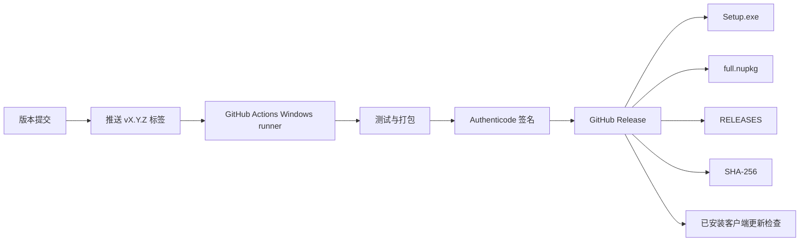

# WeMediaBuddy Windows 发布与更新设计

日期：2026-08-08  
状态：Owner 已批准；独立规格复核通过  
目标阶段：熟人内测  
目标平台：Windows 10/11 x64

## 1. 目标

把 WeMediaBuddy 从“可生成本地打包目录”升级为普通用户可安装、可后台获取更新、可在不中断业务任务的前提下完成升级、出现坏版本时可恢复的 Windows 桌面应用。

成功状态：

1. 用户只需下载并运行一个 `WeMediaBuddy Setup.exe`，无需安装 Node.js、npm、Git、Python、SQLite 或 MCP 服务。
2. 应用从官方 GitHub Releases 检查更新，后台下载后由用户选择立即重启或稍后更新。
3. 更新不覆盖工作空间数据库、素材、Pi 会话、模型配置或专用浏览器登录态。
4. Pi、员工任务、今日扫描、发布准备或数据库事务运行时，应用不得强制退出安装更新。
5. 发布包有可验证的来源、签名和 SHA-256；发布凭证、API Key 与平台 cookies 不进入仓库、日志或诊断包。
6. 一台没有开发工具链的干净 Windows x64 机器可以完成安装、首次启动和从上一版本覆盖升级。

## 2. 已批准决策

| 决策 | 选择 |
| --- | --- |
| 首发用户 | 熟人内测 |
| 下载渠道 | 公开 GitHub Releases |
| 构建体系 | 保留 Electron Forge |
| Windows 安装器 | Squirrel.Windows |
| 更新交互 | 后台下载，下载完成后询问重启 |
| AI 服务 | BYOK；用户配置 OpenAI-compatible 服务 |
| 更新通道 | 单一稳定通道 |
| 坏版本策略 | 停止分发 + 更高版本 hotfix + 升级前数据备份；不宣传无法保证的自动降级 |

## 3. 当前基线与缺口

当前 `package.json` 的 `build` 只运行 Pi runtime 准备和 `electron-forge package`；`forge.config.ts` 只有 `packagerConfig` 与 Vite 插件，没有 maker、publisher、签名或更新配置。`README.md` 也明确说明当前只生成 `out/WeMediaBuddy-win32-x64` 可运行目录，不生成安装向导。

现有包已经携带 Electron、Pi CLI、Playwright Core、小红书 MCP Windows 二进制、Skills/扩展和 SQLite 运行能力。发布设计不得重新引入系统 Node、Python、外部数据库或要求用户运行命令。

需要补齐：

- Squirrel.Windows maker 与安装生命周期处理；
- GitHub Publisher 与受控发布工作流；
- Windows 代码签名；
- 应用内更新状态机；
- 安全退出与安装交接；
- 升级前备份、启动健康标记与恢复说明；
- 首次启动向导；
- 干净安装和覆盖升级验收。

## 4. 发行架构



### 4.1 构建与安装组件

沿用 Electron Forge，加入 Squirrel.Windows maker。发布产物至少包含：

- `WeMediaBuddy Setup.exe`：首次安装入口；
- `WeMediaBuddy-X.Y.Z-full.nupkg`：完整更新包；
- `RELEASES`：Squirrel 更新元数据；
- SHA-256 校验文件；
- 面向人的版本说明。

每个候选版和正式版必须携带由 Electron 更新服务可识别的 Squirrel `Setup.exe` 资产；发布门禁必须实际请求稳定/候选 feed，不能只核对 GitHub 页面上“看得到文件”。

应用必须尽早处理 Squirrel install/update/uninstall 启动参数，避免安装生命周期额外启动主界面或业务 runtime。应用设置固定 App User Model ID，保证快捷方式、通知和任务栏身份稳定。

### 4.2 安装边界

- 默认按用户安装，不要求管理员权限；
- 安装器创建开始菜单与标准卸载入口；
- 应用二进制与业务数据物理分离；
- 安装、更新和卸载不得删除用户选择的数据根；
- 更新不得重新创建、迁移或清空 WMB 专用浏览器 Profile；
- 首期只生成 `win32-x64` 产物。

### 4.3 GitHub 发布

版本标签格式固定为 `v<semver>`。发布工作流仅接受与 `package.json.version` 完全一致的标签。构建必须从标签对应的干净提交开始，使用 `npm ci` 和锁文件，不采用本机 `node_modules` 或已有 `out/`。

GitHub Actions 发布任务使用最小 `contents: write` 权限，并放入需要 Owner 人工批准的 GitHub Environment。代码签名材料只来自 Environment Secrets，不写入仓库、缓存、构建日志或普通 artifact。

稳定客户端由 Main 进程直接使用 Electron `autoUpdater` 和固定的 `update.electronjs.org/<owner>/<repo>/<platform>-<arch>/<version>` 地址；不采用会自行弹原生对话框的默认 `update-electron-app` 交互。Draft 不可匿名下载，只用于资产初检。候选版在同一仓库发布为 prerelease 后，由验收机器通过 `WMB_ACCEPTANCE_UPDATE_TAG=vX.Y.Z` 指向固定官方仓库的 `releases/download/<tag>` 静态 Squirrel feed；该开关只有同时设置隔离的 `WMB_ACCEPTANCE_USER_DATA` 才生效，只接受 semver 标签，不能传入 URL、仓库或本地路径。稳定 feed 不消费 prerelease。

候选版必须使用将来正式发布的同一组已签名资产完成覆盖升级验收。验收通过后只把该 prerelease 提升为正式 Release，不重新构建；提升后稳定客户端才可发现。这样候选验收与用户分发之间存在明确晋级门，而不是先让正式用户收到版本再测试。

## 5. 更新设计

### 5.1 状态机

更新状态是安装级状态，不属于任何工作空间；pending update、备份索引和健康标记必须保存在 `app.getPath('userData')` 下，不能放入 Squirrel 会替换的安装目录：

```text
idle
  → checking
  → available
  → downloading
  → downloaded
  → waiting_for_safe_restart
  → installing
```

失败进入 `error`，保留当前已安装版本继续运行。可恢复错误允许重新检查或重新下载。

Renderer 只读取明确状态并发出“检查更新”“立即重启更新”“稍后”三个意图；下载、校验、退出和安装全部由 Main 进程负责。

### 5.2 检查策略

- 应用启动、工作空间恢复完成且首屏可用后检查一次；
- 设置页提供显式“检查更新”；
- 单次运行不做高频轮询；
- 检查和下载失败不阻塞启动、本地资料或当前工作；
- 更新源固定为官方仓库 HTTPS 地址，Renderer 不得传入任意 feed URL；
- 只接受高于当前版本的有效正式版本。

### 5.3 下载与提示

发现新版本后在后台下载，不弹出阻塞窗口。下载完成后显示持久但克制的应用级提示：

- `立即重启更新`；
- `稍后`；
- 由固定官方仓库与版本标签构造的 GitHub Release 页面入口；版本说明以该页面为真源，不依赖 nupkg nuspec 的可选 `ReleaseNotes`；

用户选择“稍后”后，当前运行继续使用旧版本；下次满足安全条件时继续提示。不得在用户创作过程中倒计时强制重启。

### 5.4 安全退出与安装

用户选择立即更新时，Main 先判断当前 runtime 是否可安全退出。以下状态存在时不得直接安装：

- Pi 正在生成或处理队列；
- 通用员工任务仍在运行或取消收尾；
- 今日扫描/判断任务仍在运行；
- 发布编辑器准备或浏览器外部操作仍在进行；
- 当前数据库原子提交与 readback 尚未完成；
- 工作空间切换或 Profile 重绑定正在进行。

安全退出必须复用现有 workspace runtime drain/quit 边界：停止接收新任务，等待当前原子提交和真实回读，持久化可恢复状态，停止 Pi/MCP/小红书 MCP/调度器，释放浏览器 lease，再调用 Squirrel 安装交接。

若不能安全退出，更新保持 `downloaded` 或 `waiting_for_safe_restart`，明确告诉用户等待哪个任务结束，不得强杀进程制造假完成。

## 6. 数据保护与故障恢复

### 6.1 升级前记录和备份

在退出安装前，把以下状态持久化到 `app.getPath('userData')` 下的安装级更新目录：

- `fromVersion`；
- `toVersion`；
- 更新包身份；
- 备份位置；
- 请求时间；
- 当前工作空间 ID 和根路径；
- 更新阶段。

升级前备份：

- 当前工作空间 `wmb.db`；
- 安装级 `pi-api-config.json`；
- `workspace-registry.json`；
- `data-root.json`；
- `browser-config.json`。

素材、导出、日志和浏览器 cookies/Profile 不复制：它们原地保留，更新器不得修改。备份目录必须位于安装目录之外，并采用临时目录写完后原子改名。

模型配置备份仍可能包含由 `safeStorage` 加密的密文，因此备份与诊断导出分离；诊断包不得包含该文件。

### 6.2 新版本启动健康标记

更新后的版本只有完成以下步骤才写入 `boot-ok`：

1. 安装级配置可读取；
2. 当前工作空间数据库打开并完成迁移；
3. MCP 与必须的内部 runtime 启动完成；
4. Renderer 加载并完成 ready 握手；
5. 当前版本号与 pending update 目标一致。

健康标记用于诊断和恢复决策，不冒充 Squirrel 无法保证的系统级自动降级。

### 6.3 坏版本处理

Squirrel.Windows 无法保证应用在新版本启动前崩溃时自动回退，因此首期采用可恢复而非伪自动回滚：

1. 发布前把候选资产发布为 prerelease，并用验收专用标签开关完成真实安装和覆盖升级；
2. 验收通过后只提升同一组资产为正式 Release，不重新构建；
3. 发现坏版本后立即停止其继续进入稳定更新源；
4. 优先发布版本号更高的 hotfix，使已更新用户前进修复；
5. GitHub Releases 保留上一版安装包，并保留升级前数据库和安装级配置备份；
6. 人工恢复必须先按第 5.4 节完成安全 drain 并彻底退出应用，再运行上一版 `Setup.exe`；旧安装器可能替换整个 Squirrel 安装目录，不能在应用仍运行时启动；
7. 安装上一版后恢复与 `fromVersion` 对应的备份。工作空间和 `%APPDATA%` 配置位于安装目录之外，但数据库迁移不支持旧版读取时仍必须先恢复备份；该路径由人工执行，坏版本应用不能自我中介。

不得把“重新下载旧安装包”描述成自动回滚。

## 7. 首次启动向导

首次启动向导是安装后正常入口，不要求用户阅读 README 或打开终端。每一步可恢复；只有写入完整身份和配置后才把工作空间登记为有效。

### 7.1 系统检查

检查：

- Windows x64；
- 必要目录可写；
- 网络状态；
- 可用 Chromium 浏览器。

浏览器按顺序探测 Microsoft Edge 的常见安装目录和注册表，再探测 Chrome/Chromium；无法自动定位时允许用户选择可执行文件。浏览器缺失只阻塞平台登录、X 观察和网页发布准备，不阻塞本地资料、稿件和设置。

### 7.2 数据位置

默认提供一键创建的、用户可理解的 WMB 工作空间位置；自选目录放在“高级选项”。系统自动创建数据库、素材、日志和导出目录。

中途退出后再次启动应继续未完成向导，不得把空目录、部分 schema 或无 workspace identity 的目录登记为有效工作空间。

### 7.3 AI 配置

熟人内测采用 BYOK。用户可填写：

- 预设名称；
- Base URL；
- OpenAI Responses 或 Completions API 类型；
- API Key；
- 文本模型；
- 可选上下文与输出上限。

“测试连接”分别验证：

1. 鉴权与模型列表；
2. 最小文本请求；
3. 可选视觉模型能力。

当前硬编码视觉模型 `mimo-v2.5` 必须作为独立能力显示。视觉模型不可用时，只标记视觉能力不可用，不得把文本 Pi 整体误判为不可用。

用户可选择稍后配置。未配置时，本地资料和稿件仍可读；Today 判断、Pi 和员工任务明确显示模型未配置，不使用假 fallback。

API Key 继续使用 Electron `safeStorage` 加密，只存安装级用户目录。

### 7.4 平台登录

X、小红书和微信公众号全部可跳过，只在用户启用对应平台时要求登录：

- X/微信使用 WMB 专用浏览器 Profile；
- 小红书使用随包携带的登录程序和 MCP runtime；
- 每个平台必须读取实际登录账号验证成功；
- 一个平台失败不阻塞其他平台和本地创作；
- cookies 只保留在 WMB 专用 Profile，不上传或写入诊断包。

### 7.5 完成页

完成页展示真实状态：

- 工作空间路径；
- 文本 AI；
- 视觉 AI；
- 浏览器；
- X；
- 小红书；
- 微信公众号；
- 当前应用版本与更新通道。

未配置项显示“稍后配置”，不显示虚假的“正常”或数值零。完成后进入今日办公桌。

## 8. 安全设计

1. Windows `Setup.exe`、应用 EXE/DLL 和随包可执行文件必须使用同一可信发布身份做 Authenticode 签名；`.nupkg` 本身不冒充 Authenticode 已签名。
2. 代码签名证书及密码只存在于受审批的 GitHub Environment Secrets。
3. 发布工作流使用最小权限；普通测试工作流无 Release 写权限、无签名凭证。
4. 发布从标签对应的干净提交和锁文件构建；禁止复用开发机打包目录。
5. Release 发布 SHA-256，供 CI、Owner 和人工下载核验；应用内 Squirrel 下载按 HTTPS 与 `RELEASES` 中的文件大小/SHA-1 做内置完整性检查。首期不声称 Squirrel 会核验 nupkg 的 SHA-256 或 Authenticode。
6. API Key、Authorization header、平台 cookies、浏览器 Profile、现有用户数据库不得进入安装包或 GitHub artifact。
7. 日志和诊断导出必须做凭证字段过滤；模型配置密文文件也不得进入诊断包。
8. 更新下载、版本比较和安装请求只由 Main 进程执行；Renderer 不能提供任意路径、URL 或命令参数。
9. 更新只能从高版本前进；恢复旧版本是显式人工恢复流程，不能绕过数据兼容性判断。
10. 安装和更新失败不得删除当前可运行版本或用户数据。

## 9. 错误处理

| 场景 | 行为 |
| --- | --- |
| 离线或 GitHub 不可达 | 保持当前版本；设置页显示可重试错误 |
| 未发现更新 | 返回当前已是最新版本，不重复提示 |
| 下载中断 | 保持当前版本；允许重新下载 |
| 更新包大小或 `RELEASES` 校验不一致 | Squirrel 拒绝应用；记录不含凭证的诊断信息 |
| 有运行中任务 | 保持已下载状态，任务安全结束后再提示 |
| drain 失败 | 不调用安装；当前版本继续运行 |
| 安装失败 | 当前版本继续运行；保留更新和备份记录 |
| 新版未写 boot-ok | 标记启动异常，展示恢复信息或由支持人员按备份恢复 |
| 模型未配置 | 本地功能可用，AI 功能显示明确 blocker |
| 单个平台登录失败 | 仅该平台 `needs_user`，其他能力不降级 |

## 10. 发布验收

每个正式 GitHub Release 必须在干净 Windows x64 环境完成以下证据：

覆盖升级验收使用公开 prerelease 的原始资产、固定官方仓库和 `WMB_ACCEPTANCE_UPDATE_TAG`；验收用户数据必须由 `WMB_ACCEPTANCE_USER_DATA` 隔离。通过后将同一 Release 提升为正式版，不重新打包。

### 10.1 干净安装

- 机器没有 Node.js、npm、Git、Python 和项目源码；
- `Setup.exe` 安装成功；
- 开始菜单、应用身份和卸载入口正确；
- 应用启动进入首次向导；
- 内置 Pi runtime、SQLite、MCP、Skills 和小红书二进制无需外部安装。

### 10.2 首次启动

- 默认工作空间创建成功；
- Edge 自动发现，或用户可选择可用 Chromium；
- 文本 AI 测试与保存成功；
- 缺少 `mimo-v2.5` 时只标记视觉不可用；
- 三个平台均可跳过；
- 已登录平台能读回真实账号。

### 10.3 覆盖升级

从上一正式版本安装到目标版本：

- 检查到正确版本；
- 后台下载不阻塞当前创作；
- “稍后”不退出应用；
- 有运行任务时拒绝立即安装；
- 安全状态下重启安装成功；
- 应用版本更新；
- 数据库、素材、内容项目、Pi 会话、API 配置、浏览器登录态保持；
- pending update、备份和 boot-ok 可读回。

### 10.4 故障路径

- 离线检查不影响当前版本；
- 无效更新包拒绝安装；
- drain 失败不退出；
- 新版本启动异常时能够定位升级前备份和上一版安装包；
- 撤下坏 Release 后未更新客户端不再收到该版本；
- 更高版本 hotfix 可以覆盖坏版本。

### 10.5 发布门禁

正式发布前必须通过：

- 项目完整测试和 typecheck；
- capability/ledger/harness 发布门禁；
- Windows package 启动 smoke；
- 干净安装 smoke；
- 上一正式版到当前版的真实覆盖升级；
- 当前打包应用内 Pi 启动和一次最小业务回读；
- 安装包签名和 SHA-256 读取；
- Electron 稳定 feed 与候选 tag feed 能解析出目标 `Setup.exe`、`RELEASES` 和 nupkg；
- Release 资产清单核对。

测试成功但没有真实安装、升级和业务数据保留证据，不能发布。

## 11. 运行和所有权

- Owner 决定版本号、批准 GitHub Environment 发布、签署 Release notes，并可撤下坏 Release。
- CI 负责可重复构建、测试、签名、生成资产和上传 Draft；Owner 将资产提升为 prerelease 后执行真实更新验收，通过后再把同一 Release 提升为正式版。
- 发布脚本不得自动把未验收 Draft 提升为正式 Release。
- 应用 Main 进程拥有更新检查、下载、安全退出和安装交接。
- ActiveWorkspaceRuntime 拥有业务任务 drain 和工作空间一致性。
- Renderer 只展示状态和收集明确用户意图。

## 12. 明确不做

首期不包括：

- macOS、Linux 或 Windows ARM64；
- Microsoft Store；
- 自建更新服务器；
- 百分比灰度、企业策略或多租户通道；
- 静默强制更新；
- 自动点击平台最终发布；
- WMB 账号、订阅和托管模型计费；
- 把开发工具链安装到用户机器；
- 自研安装器、自研差分包或自研更新协议；
- 无法在新版本启动前自证安全的“自动回滚”宣传。

## 13. 实施边界

本文件定义产品与技术设计，不授权实现。后续实施计划必须把安装器、发布工作流、更新状态机、安全退出、备份恢复、首次向导和真实 Windows 升级验收拆成可独立验证的交付单元，并复用现有 Forge、workspace runtime drain、safeStorage、数据根和浏览器 Profile 边界。
