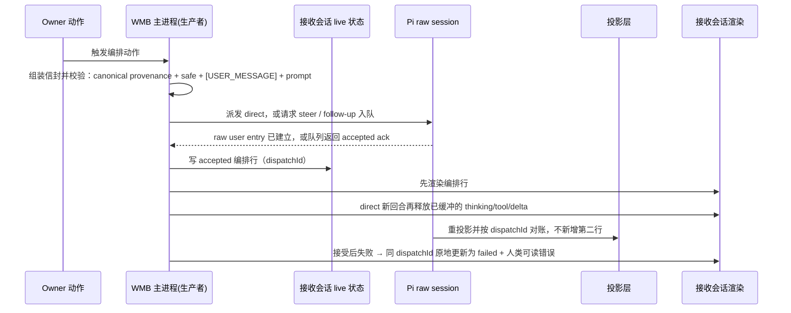

# Pi 编排会话行（orchestration transcript row）设计

- 日期：2026-08-10
- 路由：Design（产品宪法不变；仅扩展 transcript 呈现语义、会话快照与内部 provenance 信封；PRD/SPEC/PRODUCT 零改动；不新增数据库表/列、权限、命令或跨会话业务真相）
- 状态：**已锁定**（Owner lock 2026-08-10：全部 11 项已锁定（书面稿复核）；本文件不构成构造授权，施工仍需合同与 TASKS 流程）
- 前置：`docs/spark/2026-08-10-pi-system-event-harness-hardening.md`（provenance 先例：kind 唯一权威、无启发式回填、共享信封契约）、`.ai/wmb-5164-contract.md`（system_event 投影/渲染先例）、`docs/spark/2026-08-10-topic-maintenance-conflict-reproposal-design.md`（同批 Design 格式）

## 1. 问题

现状事实（来源见 §20）：

- `src/main/ipc-pi-dock.ts:45-123`：主管真回合 `runDockManagerPrompt` 把自动编排 prompt 组装成 `[WMB_CONTEXT]…[USER_MESSAGE]` 信封，写入会话时只写 `{ role: 'user', text: visiblePiPrompt(wrapped), createdAt }` —— 纯 role:user，没有任何「这是应用代写的编排」标记。
- `src/main/manager-dispatch.ts:245-263`：今日情报编排由应用代写整段 prompt（`请执行今日情报编排（${businessDate}）…`）并经同一通道派发到 Pi，同样无标记。
- `src/main/pi-transcript-projection.ts:18-55`：投影层只识别 `isJobEventEnvelope` 打 `kind:'system_event'`；其余 user 条目一律按人类消息呈现。
- `src/renderer/pi-dock-transcript.tsx:157-200`：渲染层只有三个分支（system_event / assistant / user）。

后果：

1. **语义混淆**：应用代写的编排（Owner 触发、应用写 prompt、确实派发到 Pi）在会话里与人类手打消息无法区分；用户无法知道这一行是谁写的、发出去没有、被接受没有。
2. **无状态、无错误语义**：接受前失败与接受后失败没有呈现面；今天的失败走 `dispatchFailAgentTask(… 'MANAGER_DOCK_FAILED' …)`，会话里没有任何可读痕迹。
3. **来源身份无权威**：若用可见文本猜「看起来像编排」，会重蹈 system_event（WMB-5164）已验证的错误——裸前缀启发式不可靠，honeypot 已证明人类可粘贴 lookalike。

本设计把 `orchestration` 确立为独立、可见、有来源证明的会话语义，并扩展内部投影协议与既有快照：无新业务表、无新权限、无新命令、无 Skill 变更。

## 2. 决策摘要

11 项已通过方向的浓缩；逐条完整文本见 §18 Owner lock。

1. `orchestration` 是独立可见的 transcript 语义：Owner 触发 + 应用代写 + 确实派发到 Pi；它不是人类 chat、不是 JOB_EVENT/系统通知、不是 Pi 输出、不是工具执行。
2. 范围：所有 Owner 触发、应用自动组装并发往 Pi 的工作；只在接收会话渲染——派往 Dock 的在 Dock，派往员工会话的只在该员工会话；NEVER 把员工 transcript 镜像进 Dock。
3. 排除：手动输入框、人类文本的 fork/retry、Pi 自建 job 及其工具后果、定时/后台恢复、被动 UI 操作、JOB_EVENT。
4. 来源证明由生产者显式盖章；共享传输层 MUST NOT 推断。raw/RPC 的 role 可保持 user；呈现用 `kind: orchestration`。旧消息永不启发式回填。
5. 视觉：左对齐纯文本轻量行，无气泡/卡片/背景/边框/阴影/侧条/图标；标签 11px 柔和紫、标题 12–13px 中性色、时间戳 11px 柔和；Pi 进程前 8–12px。默认结构：`已安排桌助` + 标题 + 时间 + 可展开 `查看任务要求`。
6. 展开内容只含安全结构化字段 originLabel/title/goal/acceptance；NEVER 显示 WMB_CONTEXT、内部 ID、工具名、Skill/路由/权限措辞、原始 prompt。每个符合语义的生产者必须在派发前提供完整安全字段；缺失即前置校验失败，该次任务不发送。
7. 状态文案：直接接受 `已安排桌助`；接受为 steer/follow-up `已加入桌助队列`；接受后失败同行更新为 `安排失败` + 人类可读错误；接受前失败不产生行；历史事件标签不随完成变更。
8. 交互：仅 details/summary；无复制/fork/重发/删除；非 aria-live；时间线不重排。
9. 数据模型：扩展 PiChatMessage 的 kind 与结构化 orchestration 数据（稳定 dispatchId、target、delivery、state）；复用既有会话快照；无新业务表/列。
10. 流程：USER_MESSAGE 之前的 canonical 机器元数据携带来源证明 + 安全呈现；Pi 接受后先写入编排行，再释放该 direct 新回合的 thinking/tool/delta；dispatchId 对账 live accepted 行与 raw 投影，精确一次；USER_MESSAGE 之后用户粘贴的 lookalike 仍为人类；旧会话不回填。
11. 验收：直接 / steer·follow-up / 接受后失败 / 接受前失败 / 重载去重 / 手动 chat 不变 / JOB_EVENT 不变 / 粘贴 honeypot / 无内部文本 DOM / 键盘 details / 主题与 1672·1366·1100 live Electron 检查，并覆盖 Today、资料库自动提问、Results 自动讨论、员工接收会话、跨会话隔离，以及 Pi 自建 job、定时/后台恢复、被动 UI 三类排除路径（§16）。

## 3. 产品与 intake 对齐

- 路由：Design。产品宪法（PRD/SPEC/PRODUCT）零修订：本设计只扩展 transcript 呈现语义、内部来源信封与既有会话快照，不改变任何业务真相、授权边界或工具语义。
- Capability registry impact: no change（无命令/权限/角色/grant 变化）。
- Pi operator Skill impact: no change（operator Skill 内容与 wmb_* 工具语义不变；内部上下文信封仅新增来源与安全呈现元数据）。
- 保持 Design 的条件：只要实现不需要新数据库表/列、新权限、新命令或新的跨会话业务真相。若锁定后施工发现需要上述任一，intake MUST 改路由到 Legislate，先立法再构造。

## 4. 语义分类

### 4.1 语义表

| 语义 | 谁触发 | 谁写文本 | 是否派发到 Pi | 会话呈现 |
| --- | --- | --- | --- | --- |
| human chat | 用户 | 用户 | 是 | 用户气泡（role:user 无 kind） |
| **orchestration（新增）** | Owner（应用动作） | 应用代写 | **是** | orchestration 行（§6） |
| system_event / JOB_EVENT | 系统（工单终态） | 系统 | 是（通知信封） | WMB 系统通知（kind:'system_event'，已有） |
| Pi 输出 | Pi | Pi | — | assistant 气泡/分段（已有） |
| 工具执行 | Pi 工具调用 | Pi | — | tool-line 分段（已有） |

判定不变量：

- 一行必须是「Owner 触发 + 应用代写 + 确实派发到 Pi」三者同时成立，才是 orchestration。
- 语义由生产者显式盖章决定；呈现层与传输层 MUST NEVER 依据可见文本推断语义。
- 归类互斥：一行不同时是 orchestration 与 system_event；orchestration 行 MUST NOT 成为 fork/retry 锚点（沿用 `piRetryable` 的排除语义）。

### 4.2 明确排除（NEVER 渲染为 orchestration 行）

- 手动输入框发送的人类文本（即使其内容与应用自动 prompt 完全相同）；
- 对人类文本的 fork/retry（Pi 原生分支重发）；
- Pi 自建的 job 及其工具后果（Pi 决定 spawn 的工单不是 Owner 触发）；
- 定时/后台恢复（scheduled/background recovery 未经过 Owner 触发动作）；
- 被动 UI 操作（只读浏览、会话切换、展开等不派发工作）；
- JOB_EVENT（已有 system_event 语义，互斥）。

## 5. 范围矩阵

| 路径 | 当前行为（证据） | 语义 | 渲染目标 |
| --- | --- | --- | --- |
| 今日情报编排 | `manager-dispatch.ts:245-263` 应用代写 prompt → `runDockManagerPrompt` | orchestration | Dock |
| 资料库「请 Pi 出选题」 | `library-topics-view.tsx:1106-1117` 应用代写 prompt → `wmb-pi-generate` → Dock `sendText` | orchestration | Dock |
| Results「和 Pi 讨论本周期」 | `results-view.tsx:181,265` 应用代写 prompt → `wmb-pi-generate` → Dock `sendText` | orchestration | Dock |
| Studio 初稿、Results 复盘、班组派单等员工任务 | Owner 动作启动应用生成的员工 prompt；当前经独立员工会话执行 | orchestration | 仅对应员工接收会话 |
| 手动 chat | `pi-dock.tsx:383-442` 人类输入 → `sendText` | human chat | Dock 用户气泡 |
| JOB_EVENT 通知 | manager-job-notify + 投影 | system_event | 接收会话系统通知 |

不变量：

- orchestration 行 MUST 只渲染在接收会话：Dock 目标 → Dock；员工目标 → 仅该员工会话。
- Dock MUST NEVER 镜像员工会话的 transcript（员工会话的 orchestration 行不得出现在 Dock）。
- 同一 dispatchId 在重载、重投影、重复事件下 MUST 只产生一行（§11）。

## 6. 视觉结构

### 6.1 外观

左对齐纯文本轻量行。MUST NOT 使用气泡/卡片/背景/边框/阴影/侧条/图标（与 `pi-bubble`、`pi-system-event` 容器均不同）。层级由字号与颜色建立，不增加容器。

- 标签（状态文案）：11px，柔和紫（muted violet），仅为小字号标签，符合 DESIGN.md The One Violet Voice Rule（单屏紫罗兰实色 ≤10%）。
- 标题：12–13px，中性色（ink-soft）。
- 时间戳：11px，柔和（muted-low）。
- 与后续 Pi 进程（assistant streaming 行）之间留 8–12px。

### 6.2 结构与 mockup

默认结构：状态文案 + 标题 + 时间戳同行；`查看任务要求` 为唯一可展开控件（details/summary）。

```text
已安排桌助        今日情报编排        10:02
▸ 查看任务要求
  来源：今日情报
  目标：采集并判读当日情报，产出可批方案
  验收：可信渠道回执 + 当日可批方案

已加入桌助队列    采完续接策划        10:05
▸ 查看任务要求

安排失败          今日情报编排        10:08
  渠道请求超时，未收到可信回执。
▸ 查看任务要求
```

三态示例分别对应直接接受、接受为 steer/follow-up、接受后失败（§8）。

## 7. 文案与内容安全

### 7.1 安全结构化字段（展开内容唯一来源）

| 字段 | 含义 | 要求 |
| --- | --- | --- |
| originLabel | 触发来源的人类可读名称 | 非内部标识 |
| title | 任务标题 | 人类可读 |
| goal | 目标 | 人类可读，无内部措辞 |
| acceptance | 验收标准 | 人类可读 |

- 展开内容 MUST 只渲染这四个字段。
- NEVER 渲染：WMB_CONTEXT、内部 ID（managerTaskId/objectId/sessionId/dispatchId 等）、工具名（wmb_*）、Skill/路由/权限措辞（contextRule）、原始 prompt。
- 这些 NEVER 项 MUST NOT 进入 DOM（无内部文本 DOM，§14）。
- 每个符合 §4.1 的生产者 MUST 在派发前提供完整安全字段；任一缺失均是前置校验失败，该次任务 MUST NOT 发送。NEVER 允许「任务已被 Pi 接受但没有编排行」，也 NEVER 退化为展示 raw prompt。

### 7.2 人类可读错误

接受后失败的 `安排失败` 说明 MUST 是人类可读的错误（如「渠道请求超时，未收到可信回执」），NEVER 是堆栈、内部码或工具名。

## 8. 状态与错误行为

| 情形 | 状态文案 | 行行为 |
| --- | --- | --- |
| 直接派发被 Pi 接受 | 已安排桌助 | 现有行保持 |
| steer/follow-up 被接受 | 已加入桌助队列 | 现有行保持 |
| 接受后失败 | 安排失败 + 人类可读错误 | MUST 更新同一行（按 dispatchId），NEVER 新建行 |
| 接受前失败 | — | MUST NOT 产生 orchestration 行 |
| 历史事件（JOB_EVENT）完成 | — | 系统通知标签不随完成变更 |

不变量：

- 状态文案三选一（已安排桌助 / 已加入桌助队列 / 安排失败）；不存在第四种默认文案。
- 状态变更 MUST 原地更新（同一 dispatchId、同一行），NEVER 追加新行、NEVER 重排时间线。
- orchestration 行状态只表达「派发/接受」结果，不表达任务完成度；任务终态由 JOB_EVENT（system_event）承载，两者互不覆盖；orchestration 行状态也 NEVER 推进为「已完成」。

## 9. 数据模型

设计级类型草案（非实现契约；锁定后由合同细化，不引入任何新业务表/列）：

```ts
type OrchestrationTarget = 'dock' | 'employee';
type OrchestrationDelivery = 'direct' | 'steer' | 'follow_up';
type OrchestrationState = 'accepted' | 'failed';
type OrchestrationSafe = {
  originLabel: string;   // 人类可读来源
  title: string;         // 任务标题
  goal: string;          // 目标
  acceptance: string;    // 验收标准
};
type OrchestrationData = {
  dispatchId: string;               // 稳定、跨 live/raw 精确一次对账
  target: OrchestrationTarget;      // 接收会话类别
  delivery: OrchestrationDelivery;  // 直接回合或 Pi 原生队列
  state: OrchestrationState;
  safe: OrchestrationSafe;
  error?: string;                   // 仅 state === 'failed'：人类可读错误
};
```

扩展方式：

- `PiChatMessage.kind` 从 `'system_event'` 扩展为 `'system_event' | 'orchestration'`（pi-conversation.ts:9-18 的现有字段语义不变）。
- orchestration 行的持久化复用既有 `PiConversationSnapshot.messages`（既有会话快照），无新表、无新列、无迁移。
- `normalizeMessage` 的既有「仅在 kind 已存在时保留」语义继续适用：无 kind 的遗留消息保持 kindless（§13）。
- raw Pi session 的 role 保持 `user`（RPC 兼容与可追溯），呈现语义由 kind 决定（§14）。

## 10. 生产者 → live → raw → 投影 流程

时序（Mermaid 仅澄清顺序）：



逐步契约：

1. **盖章与校验（生产者）**：`[USER_MESSAGE]` 之前 MUST 存在 canonical 机器元数据块，携带来源证明（dispatchId、target、delivery、语义标记）与安全呈现（originLabel/title/goal/acceptance）。格式以共享信封契约为唯一真源；生产者与投影层 MUST 同源消费，禁止手抄字面量。安全字段缺失时 MUST 在派发前失败。
2. **接受定义**：direct prompt 的 canonical raw user entry 已建立，即证明 Pi 已接受；steer/follow-up 的队列 ack 返回，即证明 Pi 已接受。两种证据均不存在才是接受前失败。canonical raw entry 本身不需要另带可变 state，投影时其存在即确定 `state='accepted'`。
3. **接受门**：接受前不展示编排行。direct 新回合若有 thinking/tool/delta 抢先到达，主进程 MUST 暂存这些新回合事件，直到 accepted 行已经写入并广播；活动回合原有输出不因新入队任务而暂停。
4. **raw 传输**：raw JSONL/RPC 容器与 role=user 语义不变；新的 orchestration payload 会有意携带 canonical 元数据，因此不声称与旧 prompt 文本逐字节一致。
5. **接受与 live 行**：取得 direct raw-entry 证明或 queue ack 后，主进程 MUST 写入并广播 `state='accepted'` 的 orchestration 行；direct 路径随后释放对应 Pi 输出。接受前失败不产生可见行。
6. **投影**：投影层只对已存在的 canonical raw user entry 生成 `kind='orchestration' + state='accepted' + OrchestrationData`；已 ack 但尚未写入 raw 的队列行由既有会话快照持久化，raw 投影 MUST 保留它，待同 dispatchId entry 出现后再对账。`visiblePiPrompt` 对普通人类消息的既有剥离语义不变。
7. **对账**：投影行的 dispatchId 与 live accepted 行精确一次合并（§11）。
8. **人类 lookalike**：出现在 USER_MESSAGE 之后、或任何未盖章路径的文本 MUST 保持人类消息（honeypot，§14）。

## 11. 精确一次与重放不变量

- dispatchId MUST 稳定唯一（每次实际派发一个 ID）。
- live accepted 行与 raw 投影行 MUST 以 dispatchId 合并；合并 MUST 恰好发生一次。
- 重载（`getPiConversation` 全量刷新）、重复 onDataChanged、重复重投影 MUST NOT 产生第二行。
- 对账幂等：canonical raw 投影先于 live accepted 事件到达时，该 raw entry 已是接受证明，MUST 直接形成一行并忽略后到的同 dispatchId 事件。
- 已获 queue ack、尚未形成 raw entry 的 accepted 行 MUST 保留在会话快照中；投影刷新不得把它删除，后续同 dispatchId raw entry 只做对账。
- 旧会话、旧消息 MUST NOT 被启发式回填为 orchestration（§13）。
- JOB_EVENT 与 orchestration 各行按自身 dispatchId/entryId 独立去重，互不干扰。

## 12. 可访问性与响应式

- 展开交互 MUST 仅用 details/summary（原生键盘可达，无焦点陷阱、无自定义控件）。
- orchestration 行 MUST NOT 提供复制/分叉/重发/删除动作；MUST NOT 成为 fork/retry 锚点（沿用 `piRetryable` 排除 system_event 的同一语义）。
- 行 MUST NOT 是 aria-live 区域（是静态记录，不打断读屏播报；与 `pi-activity` 的 polite 播报不同）。
- 状态更新 MUST 原地发生，时间线顺序 NEVER 重排（顺序即发生顺序，§8）。
- 主题：柔和紫标签在光/暗两个主题下 MUST 满足 DESIGN.md 对比度要求（Status Is Semantic：状态有文字，不单靠颜色）。
- 响应式：长标题与展开内容 MUST 允许自然换行（overflow-wrap: anywhere / word-break 语义），三个实测宽度 1672 / 1366 / 1100 的 live Electron 检查 MUST 无横向滚动、无内容截断。
- 本行无动画，无 reduced motion 额外需求；若未来沿用既有 180–220ms 展开动画，则 MUST 遵守 reduced motion（当前设计不新增动画）。

## 13. 兼容与迁移

- 旧消息 NEVER 回填：没有 canonical 元数据的遗留 user 消息保持现状（普通可见文本，kindless）。
- raw JSONL/RPC 容器与 role=user 语义不变；新的 orchestration prompt 文本会有意新增 canonical 元数据，不承诺与旧 payload 字节一致。
- 既有 system_event kind、渲染与 `piRetryable` 语义不变；`preferProjectedMessages` 只有在投影器既能从 canonical raw entry 完整重建 orchestration 数据、又能保留已 ack 但尚无 raw entry 的队列行时才可继续沿用，不能丢失来源字段或 accepted 行。
- 历史事件标签不随完成变更：JOB_EVENT 系统通知完成与否都不改写；orchestration 行状态也不推进为「已完成」（§8）。
- 无数据库迁移、无历史数据改写；本设计是可选消息字段扩展，旧会话文件可直接打开。

## 14. 安全与来源证明

- 来源证明 MUST 由生产者显式盖章（canonical 机器元数据）；共享传输层与呈现层 MUST NEVER 依据可见文本推断来源。
- 语义标记（kind）是唯一作者身份权威（与 system_event / harness-hardening 同一原则）；无启发式、无「看起来像」判定。
- 无内部文本 DOM：展开内容 MUST 只含安全字段；WMB_CONTEXT、内部 ID、工具名、Skill/路由/权限措辞、原始 prompt MUST NEVER 进入 DOM。
- Honeypot：人类把完整信封 token（含 orchestration 元数据）粘贴进 USER_MESSAGE 之后 → MUST 保持人类消息；任何前缀/内容匹配都不足以打标。
- 不新增命令、权限、角色、grant；不动 auth 边界；不新增业务表/列（§9）。

## 15. 非目标

- 手动输入框、人类文本 fork/retry、Pi 自建 job 及其工具后果、定时/后台恢复、被动 UI 操作、JOB_EVENT —— 均不进入 orchestration 语义。
- 不做启发式回填/迁移（历史消息不追溯打标）。
- 不做全局 UI 重设计：只新增本行样式与 details/summary 展开，不新增其他控件。
- 不新建业务表/列、不新增跨会话业务真相（因此保持 Design；若违反则改路由 Legislate，§3）。
- 不改变 raw session 的 JSONL/RPC 容器、role 语义或 wmb_* 工具语义；新的 orchestration payload 增加 canonical 来源元数据是本设计的明确组成，不属于业务指令或工具语义变化。
- 不把 orchestration 行扩展为任务追踪/进度 UI（终态由 JOB_EVENT 承载）。

## 16. 未来实现验收矩阵

锁定并进入施工后，按以下矩阵逐项验收（本文件已锁定但不构成构造授权；矩阵在此定义为未来验收基线）：

| # | 验收项 | 可观察判据 |
| --- | --- | --- |
| 1 | 直接派发 | 接受后显示「已安排桌助 + 标题 + 时间 + 查看任务要求」；行在 Pi thinking/tool/delta 之前出现；前后间距 8–12px |
| 2 | steer/follow-up | 显示「已加入桌助队列」，行在队列中保持原位 |
| 3 | 接受后失败 | 同一行（同 dispatchId）变为「安排失败 + 人类可读错误」，无新行、无堆栈/内部码 |
| 4 | 接受前失败 | 会话中无 orchestration 行残留 |
| 5 | 重载/去重 | 全量 reload、重复 onDataChanged、重复重投影后每 dispatchId 恰一行 |
| 6 | 手动 chat 不变 | 人类消息仍为普通用户气泡，无 kind，fork/retry 语义不变 |
| 7 | JOB_EVENT 不变 | 系统通知分类与渲染不变；与 orchestration 行互不覆盖 |
| 8 | honeypot | 粘贴完整信封 token（含 orchestration 元数据）于 USER_MESSAGE 之后 → 仍人类 |
| 9 | 无内部文本 DOM | 展开内容仅含 originLabel/title/goal/acceptance；WMB_CONTEXT/内部 ID/工具名/Skill·路由·权限措辞/原始 prompt 不在 DOM |
| 10 | 键盘/details | 仅 details/summary 可展开；键盘可达；无焦点陷阱；无 aria-live |
| 11 | 主题与宽度 | 光/暗两主题对比度达标；1672 / 1366 / 1100 live Electron 检查无横向滚动、无截断 |
| 12 | 代表性路径覆盖 | Today、资料库自动提问、Results 自动讨论、Studio/Results/班组员工接收会话各至少一条；符合 §4.1 的所有生产者均提供安全字段并显式盖章 |
| 13 | 接收会话隔离 | Dock 目标只进 Dock；员工目标只进对应员工会话；员工 transcript 不镜像到 Dock |
| 14 | Pi 自建 job 排除 | 让 Pi 经工具自行 spawn job 并接收工具结果；当前会话及 reload 后均不新增 orchestration 行 |
| 15 | 定时/后台恢复排除 | 执行一次 scheduled/background recovery；涉及会话及 reload 后均不新增 orchestration 行 |
| 16 | 被动 UI 排除 | 执行浏览、切换会话、展开详情等不派发动作；前后 transcript 完全不新增 orchestration 行 |

## 17. 风险

1. **信封与派发漂移**：生产者元数据与实际派发内容不一致 → 对账错行。缓解：共享信封契约 + 同源消费 + §16 验收 5/8。
2. **生产者漏迁移**：符合 §4.1 的入口缺少安全字段或盖章 → 可能重现无因果行。缓解：派发前强校验并失败；§16 验收 12 覆盖代表路径与生产者清单，禁止静默发送。
3. **历史不可恢复**：旧编排行无元数据，无法追溯打标。缓解：明确非目标（§13/§15），不声称恢复。
4. **范围蔓延**：施工若需新业务表/列、权限、命令或跨会话业务真相 → MUST 改路由 Legislate（§3），本文件自动降级为参考。
5. **员工会话泄漏**：employee 目标的编排行若被镜像进 Dock，违反 §2。缓解：范围矩阵强制 Dock NEVER 镜像员工 transcript；§16 验收 13 专门验证隔离。

## 18. Owner lock（2026-08-10 书面稿复核已确认）

Owner 已于 2026-08-10 经书面稿复核确认锁定（Owner lock 2026-08-10：全部 11 项已锁定）。本文件锁定的是设计内容，**不是构造授权**；施工仍需走合同与 TASKS 流程（docs/intake-routing.md 权限阶梯）。以下 11 项编号决策均已锁定：

1. （已锁定）`orchestration` 是独立可见的 transcript 语义：Owner 触发 + 应用代写 + 确实派发到 Pi；它不是人类 chat、JOB_EVENT/系统通知、Pi 输出或工具执行。
2. （已锁定）范围覆盖所有 Owner 触发的、自动组装并发往 Pi 的 WMB 动作；只在接收会话渲染：Dock 目标在 Dock，员工目标只在该员工会话；NEVER 把员工 transcript 镜像进 Dock。
3. （已锁定）排除手动输入框、人类文本 fork/retry、Pi 自建 job 及工具后果、定时/后台恢复、被动 UI 操作、JOB_EVENT。
4. （已锁定）来源证明由生产者显式盖章；共享传输 MUST NOT 推断。raw/RPC role 可保持 user；呈现用 `kind: orchestration`。旧消息永不启发式回填。
5. （已锁定）视觉：左对齐纯文本轻量行，无气泡/卡片/背景/边框/阴影/侧条/图标；标签 11px 柔和紫、标题 12–13px 中性色、时间戳 11px 柔和；Pi 进程前 8–12px；默认结构 `已安排桌助` + 标题 + 时间 + 可展开 `查看任务要求`。
6. （已锁定）展开内容为安全结构化 originLabel/title/goal/acceptance；NEVER 显示 WMB_CONTEXT、内部 ID、工具名、Skill/路由/权限措辞、原始 prompt；所有符合语义的生产者必须在派发前提供安全字段，缺失则该次任务不发送。
7. （已锁定）状态文案：直接接受 `已安排桌助`；接受为 steer/follow-up `已加入桌助队列`；接受后失败同行更新为 `安排失败` + 人类可读错误；接受前失败不产生行；历史事件标签不随完成变更。
8. （已锁定）交互仅 details/summary；无复制/fork/重发/删除；非 aria-live；时间线不重排。
9. （已锁定）数据模型扩展 PiChatMessage 的 kind 与结构化 orchestration 数据（稳定 dispatchId、target、delivery、state）；复用既有会话快照；无新业务表/列。
10. （已锁定）USER_MESSAGE 之前的 canonical 机器元数据携带来源证明 + 安全呈现；direct raw user entry 或 steer/follow-up queue ack 是接受证据；接受后先写入编排行，再释放 direct 新回合的 thinking/tool/delta；dispatchId 精确一次对账 live accepted 行与 raw 投影；USER_MESSAGE 后粘贴的 lookalike 保持人类；旧会话不回填。
11. （已锁定）验收覆盖：直接 / steer·follow-up / 接受后失败 / 接受前失败 / 重载去重 / 手动 chat 不变 / JOB_EVENT 不变 / 粘贴 honeypot / 无内部文本 DOM / 键盘 details / 主题与 1672·1366·1100 live Electron 检查，并覆盖 Today、资料库自动提问、Results 自动讨论、员工接收会话、跨会话隔离，以及 Pi 自建 job、定时/后台恢复、被动 UI 三类排除路径。

Non-goals：不做启发式回填与历史迁移、不新增除 details/summary 外的控件与全局 UI 重设计、不新增业务表/列与跨会话业务真相、不扩展权限/角色/grant、不改 PRD/SPEC/PRODUCT；不改变 raw JSONL/RPC 容器和 role 语义，但新的 orchestration payload 会按本设计携带 canonical 来源元数据。

- Route: Design（若施工需要新 DB 表/列、权限、命令或跨会话业务真相 → intake MUST 改路由 Legislate）。
- Design path: docs/spark/2026-08-10-pi-orchestration-transcript-design.md
- 确认记录：**Owner lock 2026-08-10：全部 11 项已锁定（书面稿复核）。**（本文件不构成构造授权；施工仍需合同与 TASKS 流程）

## 19. Capability 与 Pi operator Skill 影响

- **Capability registry impact: no change** — 无命令/权限/角色/grant 变化；纯呈现语义与会话快照扩展。
- **Pi operator Skill impact: no change** — operator Skill 内容与 wmb_* 工具语义不变；内部上下文信封新增来源与安全呈现元数据，不改变业务指令。

## 20. 来源引用

- `src/main/ipc-pi-dock.ts:45-123` — 主管真回合 `runDockManagerPrompt`：应用组装 `[WMB_CONTEXT]…[USER_MESSAGE]` 信封、写 plain `role:user`、steer 分支 broadcast `queued/steer`。
- `src/main/manager-dispatch.ts:245-263` — 今日情报编排应用代写 prompt 并派发；失败走 `dispatchFailAgentTask(… 'MANAGER_DOCK_FAILED' …)`。
- `src/renderer/pi-dock.tsx:105-138` — reload 路径（`getPiConversation` 全量刷新，保留 live streaming 助手含 tool-line）；`:383-447` — 手动 chat 与 `wmb-pi-generate` 应用自动动作当前共用 `sendText`，缺少显式来源参数。
- `src/main/pi-transcript-projection.ts:18-55` — `visiblePiPrompt` 与仅 `isJobEventEnvelope` 打 `kind:'system_event'`。
- `src/main/pi-conversation.ts:9-18` — PiChatMessage 模型（kind 现仅 'system_event'）；`:118-126` — 投影替换偏好；`:183-200` — 会话文件读取/重投影。
- `src/renderer/pi-dock-transcript.tsx:157-200` — 现有三渲染分支与复制/fork/retry 动作区。
- `src/renderer/pi-dock-utils.ts:4-12` — `isPiSystemEvent` / `piRetryable`（system_event 非 fork/retry 锚点）。
- `src/renderer/styles-pi.css:209-280` — 气泡/系统通知/工具行样式与间距 token。
- `DESIGN.md:155-185,230-234` — The One Violet Voice Rule、Status Is Semantic、User Language Rule、Flat-by-Default、One Boundary；Pi 回复区排版规则。
- `.ai/wmb-5164-contract.md` — kind 权威、无启发式判定、honeypot 先例。
- `docs/spark/2026-08-10-pi-system-event-harness-hardening.md` — 共享信封契约模式；kind 唯一作者身份权威；无回填不变量。
- `docs/spark/2026-08-10-topic-maintenance-conflict-reproposal-design.md` — 同批 Design 格式与待锁 Owner lock 块。
