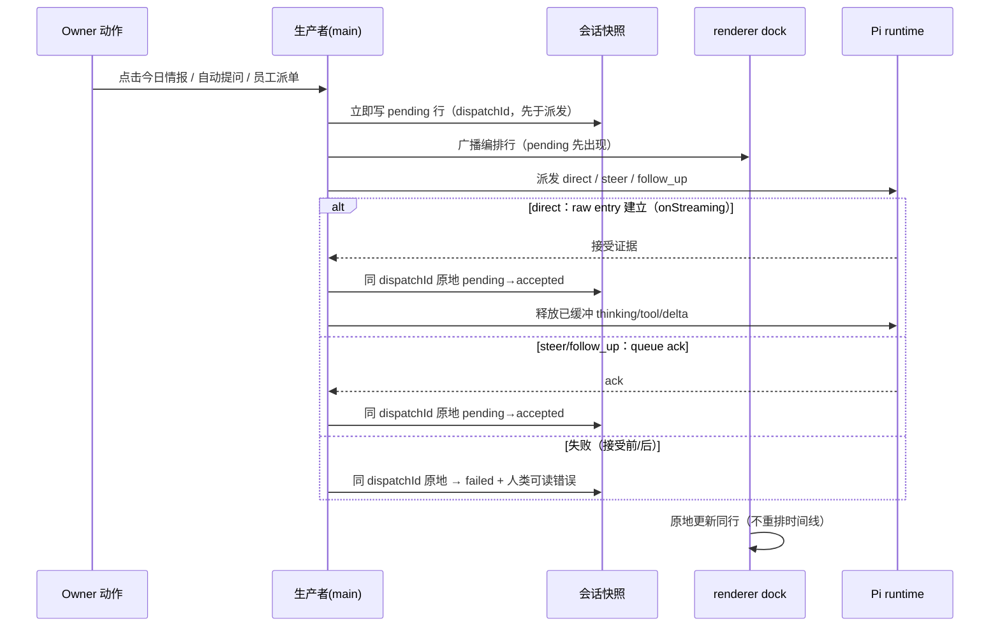

# Pi 编排即时反馈修订设计（immediate feedback amendment）

- 日期：2026-08-11
- 路由：Design（产品宪法不变；仅扩展编排生命周期行与忙时队列反馈的呈现/解析语义，复用既有会话快照与 IPC 通道；PRD/SPEC/PRODUCT 零改动；无新数据库表/列、命令、能力、角色、grant、Pi 工具或依赖）
- 状态：**已确认（Owner lock 2026-08-11）**——§17 Owner lock 六项决策已逐字锁定并获构造授权；施工经合同 `.ai/wmb-5189-contract.md` + TASKS WMB-5189 doing 行使（docs/intake-routing.md 权限阶梯）
- 修订对象：`docs/spark/2026-08-10-pi-orchestration-transcript-design.md`（下称「原设计」）
- 前置：WMB-5177..5180 done（canonical 信封/投影/对账/渲染/集成验收已落地）；本修订是在其上的呈现语义修订

## 1. 本修订替代范围（supersedes，仅此三处）

1. 原 §8/§10.5「接受前失败不产生 orchestration 行」→ 派发起点即产生 pending 生命周期行；接受前失败同 dispatchId 原地转「安排失败」。
2. 原 §9 `OrchestrationState` 仅 `'accepted' | 'failed'` → 增加 `'pending'`；原「状态文案三选一」扩为四态（新增「正在安排主管」），accepted/failed 语义不变。
3. 原 §5/§10 手动忙时 chat「保持原样（仅状态文字，无本地反馈）」→ 忙时提交立即产生安全本地队列反馈项。

除上述三处外，原设计全部不变量保留（§5 保留清单）。

## 2. 问题与现场证据

现状事实（2026-08-11 实机，WMB-5177..5180 落地后）：

- 08:57:46Z：Owner 点击今日情报 → manager task 创建（manager-dispatch.ts:240-285 先建任务、再异步 runDockManagerPrompt）。
- 08:58:09.485Z：canonical direct 编排行才以 accepted 落盘（dispatchId 46562fef…，约 23 秒后）。中间窗口会话零行——**接受前不可见**：ipc-pi-dock.ts:124-289 的 accepted 行只在 `onStreaming`（Pi 接受、raw entry 建立）时经 appendAcceptedDockRow 写入。
- 08:58:11.112Z：忙时人工消息入队。queue_update → index.ts:181-183 用 `visiblePiPrompt`（首 `[USER_MESSAGE]` 标记截断）映射；而 pi-skill-routing.ts:4-20 对 FACTUAL_WRITING 文本在正文前插入 `/skill:… [USER_MESSAGE]\n` 前缀 → 提取结果变成 raw `[WMB_CONTEXT] page=today…` → 队列区（pi-dock-transcript.tsx:194-245 直接渲染 `queue.steering/followUp` 字符串）泄漏内部上下文与 authority 行。

结论：静态实现与已落盘 accepted 行证明功能存在；当前缺口 = ① 接受前不可见（约 23s 空白）；② 忙时人工反馈不安全（raw WMB_CONTEXT/authority 泄漏）且延迟（仅状态文字，native 条目依赖 Pi 侧 queue_update 才出现）。

## 3. 决策摘要（Owner 已选方向）

1. 终端发起任务点击 → 立即创建特殊生命周期行「正在安排主管 · <safe.title>」；同 dispatchId 原地转「已安排主管」/「已加入主管队列」/「安排失败」；pending 永不暗示接受或任务完成。
2. 忙时人工消息 → 立即创建安全本地队列反馈项（仅 trimmed 人类输入）；native queue ack 替换/对账；失败移除或明确标记；不做乐观 transcript 用户气泡；raw WMB_CONTEXT、authority ids/blocks、Skill/路由文本永不进 DOM。
3. 保留 direct 接受门（接受后才释放 Pi 输出）、编排语义排除（原 §4.2）、JOB_EVENT 任务终态真相。
4. 一个共享 canonical 可见文本提取器：处理 skill 路由多 `[USER_MESSAGE]` 标记、剥离 authority/内部上下文；队列与 transcript 投影同源消费。
5. 同 dispatchId 精确一次；native ack 不产生重复队列项；重载/对账显式。
6. 无新 DB 表/列、命令、能力、角色、grant、Pi 工具、依赖。

## 4. 产品与 intake 对齐

- 路由：Design。PRD/SPEC/PRODUCT 零修订；本修订只扩展 transcript/队列的呈现与解析语义，不改变任何业务真相、授权边界或工具语义。
- **Capability registry impact: no change** —— 无命令/权限/角色/grant 变化；纯呈现与内部解析。
- **Pi operator Skill impact: no change** —— 不触碰 Skill 内容、wmb_* 工具、Pi 可见 prompt 或操作流程；Pi 侧看到的信封、role=user、JSONL/RPC 容器与工具语义零变更（与 WMB-5177..5180 同一理由：内部元数据与本地呈现，不影响 Pi 运行行为）。
- 保持 Design 条件：若锁后施工发现需要新 DB 表/列、权限、命令或跨会话业务真相 → intake MUST 改路由 Legislate。

## 5. 保留的原不变量（不因本修订改变）

- 编排语义定义与 §4.2 六类排除（手动 chat / fork·retry / Pi 自建 job / 定时·后台 / 被动 UI / JOB_EVENT）。
- 来源证明由生产者显式盖章；共享层绝不按可见文本推断；honeypot（USER_MESSAGE 后粘贴 lookalike 仍人类）。
- 接受门：direct 以 canonical raw entry 建立为接受证据、steer/follow-up 以 queue ack 为接受证据；接受后才释放 direct 新回合 thinking/tool/delta。
- 安全字段（originLabel/title/goal/acceptance）前置校验，缺失即不发送；展开只渲染安全字段。
- JOB_EVENT（system_event）与 orchestration 互不覆盖；行状态不表达任务完成度。
- 接收会话隔离：Dock 目标进 Dock、员工目标只进员工会话、Dock 永不镜像员工 transcript。
- 精确一次：同 dispatchId 恒一行；重载/重复事件不产生第二行；旧消息不回填。

## 6. UX 状态表

### 6.1 编排行四态（orchestration row）

| 状态 | 状态文案 | 出现时机 | 语义 |
| --- | --- | --- | --- |
| pending | 正在安排主管 | 派发起点（Owner 动作后立即） | 已发起，尚未被 Pi 接受 |
| accepted · direct | 已安排主管 | raw entry 建立（Pi 接受 direct） | 编排已进入执行 |
| accepted · steer/follow_up | 已加入主管队列 | queue ack 返回 | 编排已入 Pi 原生队列 |
| failed | 安排失败 + 人类可读错误 | 接受前失败或接受后失败 | 未安排成功（不表达完成度） |

- 迁移路径唯一：pending → accepted（direct / steer / follow_up）；pending → failed；accepted → failed（接受后失败）；全部同 dispatchId 原地更新，时间线不重排。
- pending 行与 accepted/failed 行同结构（safe 字段同源、可展开「查看任务要求」）。

### 6.2 忙时人工消息（queue-feedback item）

| 时刻 | 本地项状态 | 呈现 |
| --- | --- | --- |
| 忙时提交 | pending | 队列区本地项「排队中 · <trimmed 输入>」立即出现 |
| steer ack（'queued' 事件） | pending | 保持（等待 native 显示） |
| queue_update 到达且可见文本匹配 | in_queue → native 接管 | 移入 native 队列列表；不重复 |
| steer 失败 | failed | 标记失败 + toast（或移除） |
| 回合结束（idle/stopped） | 清理残余 | 已处理（结果见 transcript） |

- 不做乐观 transcript 用户气泡：忙时消息不写 PiChatMessage、不进会话快照。

## 7. 数据/状态模型

```ts
type OrchestrationState = 'pending' | 'accepted' | 'failed';   // 原 §9 扩展
type QueueFeedbackItem = {                                    // renderer 本地瞬态，不持久化
  localId: string;        // crypto.randomUUID()
  text: string;           // 仅 trimmed 人类输入
  status: 'pending' | 'in_queue' | 'failed';
  createdAt: string;
};
```

- pending 行 = `PiChatMessage{kind:'orchestration', orchestration:{dispatchId,target,delivery,state:'pending',safe}}`，复用既有 `PiConversationSnapshot.messages`（无新表/列/迁移）。
- `normalizeMessage` 保留语义扩展：`isValidOrchestrationData` 认可 pending（safe 四字段完整；error 仅 failed 携带）。
- store 辅助扩展（pi-orchestration-store.ts）：`appendPendingOrchestration`（dispatchId 幂等）、`transitionOrchestrationState`（pending→accepted/failed 原地；accepted→failed）、`reconcileOrchestrationRows` 状态优先级 `failed > accepted > pending`。
- 对账优先级理由：pending 只是占位，raw 投影的 accepted 证明必须能覆盖 stored pending；accepted/failed 保持 live 权威（原语义）；pending 行无 raw entry，投影刷新时按 queue-ack-only 同一语义保留（不删除）。

## 8. 共享可见文本提取器（canonical visible-prompt extractor）

- 位置（提案）：`src/shared/pi-visible-prompt.ts`（main 与 renderer 共用；替换现 `visiblePiPrompt` 全部消费面，禁止手抄字面量）。
- 单源函数 `extractVisiblePrompt(text)`：
  1. `parseOrchestrationEnvelope(text)` 命中 → 返回 `safe.title`（编排行权威可见文本）；
  2. 否则取**最后一个** `[USER_MESSAGE]\n` 标记之后的文本（skill 路由可在正文前插入更早标记——原首标记逻辑即泄漏根因）；
  3. 剥离尾部 authority/内部行：`taskId=` / `grantId=` / `workerLeaseId=`、`[WMB_TASK_AUTHORITY]`、`[WMB_AUTHORITY_BLOCKED]`（pi-page-authority.ts:47-59 注入格式）；
  4. 去 `/skill:*` 前缀与残留包装；
  5. 解析失败/空 → 安全兜底文案（fail-closed，绝不回退 raw）。
- 消费面：main `index.ts` queue_update 映射、main `pi-transcript-projection.ts` 投射、renderer 队列 section 渲染、renderer 本地项文本归一（对 plain 文本幂等）。

## 9. 生产者 → main → renderer 流程



忙时人工消息（renderer 本地闭环，主进程仅既有通道）：

```text
提交（忙）→ 本地项 pending → chatPi(steer)
  ├─ steer 抛错 → 本地项 failed + toast
  ├─ 'queued' 事件 → 保持
  └─ queue_update → 提取器可见文本 FIFO 匹配 → 本地项转 native（in_queue 后移除）
回合 idle/stopped → 清理残余本地项
```

## 10. 失败 / 重载 / 并发语义

- 接受前失败：pending 行原地 → failed（同 dispatchId）；原「不产生行」由本修订替代。
- 接受后失败：不变（原地 failed）。
- pending 行写入/广播失败：MUST 中止该次派发并返回人类可读失败，不得在无可见生命周期行时静默把任务送进 Pi；若业务 manager task 已创建，沿既有失败路径收口为 failed。
- 重载：pending 行自快照恢复；对账保留（同 queue-ack-only）；同 dispatchId raw accepted 投影覆盖 stored pending；accepted/failed 行 live 权威。
- 并发/重复触发：manager task 串行门（focus_existing）沿用；dispatchId 每次实际派发唯一；append/transition 同 dispatchId 幂等（重复事件 no-op）。
- 忙时消息并发：本地项 FIFO 与 native 条目全文匹配一对一；重复文本不串项；queue_update 重放不产生重复项。
- 提取器失败：fail-closed 兜底文案（DOM 永不见 raw）。

## 11. 安全边界（redaction boundary）

- DOM 可含：状态文案、safe.title、时间、safe 四字段展开、trimmed 人类输入、提取器输出。
- DOM NEVER：WMB_CONTEXT 任意行（page=/pageLabel=/objectType=/objectId=/contextRule=）、taskId=/grantId=/workerLeaseId=、[WMB_TASK_AUTHORITY]/[WMB_AUTHORITY_BLOCKED]、[ORCHESTRATION] 元数据、/skill:* 与 Skill 措辞、原始 prompt、内部 ID（managerTaskId/objectId/sessionId/dispatchId）。
- 提取器输出 = DOM 准入边界；honeypot 语义不变（无盖章文本永不获编排身份）。

## 12. 影响文件与测试（已锁定；最终 Allowed paths 以 `.ai/wmb-5189-contract.md` 为准）

- `src/shared/pi-visible-prompt.ts`（新，提取器单源；或并入 orchestration-envelope.ts）
- `src/main/pi-conversation.ts`（state 类型 + normalizeMessage）
- `src/main/pi-orchestration-store.ts`（appendPending / 原地迁移 / 对账优先级）
- `src/main/ipc-pi-dock.ts`（派发起点写 pending；接受门不变、accepted/failed 原地）
- `src/main/manager-dispatch.ts`（Today 编排 pending 接线，如需）
- `src/main/pi-transcript-projection.ts`、`src/main/index.ts`（换同源提取器）
- `src/renderer/pi-dock.tsx`（本地队列反馈项 + 对账）、`pi-dock-transcript.tsx`（队列 section 提取器渲染 + 四态文案）、`pi-dock-utils.ts`（orchestrationStatusLabel 四态）
- `tests/wmb-5189-immediate-feedback.test.mjs`（新）
- `.ai/wmb-5189-contract.md` / `.ai/wmb-5189-evidence.md`（锁后）
- 禁止面：DB/schema/迁移、capability registry、PRD/SPEC/PRODUCT/TECHNICAL_DESIGN/PLAN、skills/*、raw session 写格式与历史会话文件。

## 13. 实现任务：WMB-5189（单任务，已锁定并授权施工）

- Route: Design · Milestone: M-5140 · Capability: CAP-014/CAP-027 · Depends: WMB-5177..5180（均 done）
- Goal: 落地本修订——pending 生命周期行、忙时安全本地队列反馈、共享可见文本提取器。
- 聚焦验收：`tests/wmb-5189-immediate-feedback.test.mjs` 全绿（pending 创建/原地迁移/对账优先级/提取器多标记+authority 剥离/honeypot/忙时项 FIFO 一对一/native ack 不重复/重载保留/无内部文本 DOM）+ `npm run typecheck` exit 0 + 隔离 Electron 同路径门 1672/1366/1100（复用 `.ai/wmb-5180-ui-acceptance.mjs` harness 模式：四态文案、pending 先于 Pi 输出、忙时反馈无 raw 泄漏、重载一致、无横向滚动/截断）。
- Capability registry impact: no change；Pi operator Skill impact: no change（理由见 §4）。

## 14. 非目标

- 不做乐观 transcript 用户气泡（忙时消息不进会话快照）。
- 不新增 DB 表/列/迁移、命令、能力、角色、grant、Pi 工具或依赖。
- 不改 raw JSONL/RPC 容器与 role=user 语义、不改 wmb_* 工具语义。
- 不对历史消息回填/追溯打标；旧会话不回填 pending。
- 不做全局 UI 重设计（仅新增生命周期行状态与队列反馈项；无新控件、无动画、无 aria-live 变更）。
- 行状态不表达任务完成度（JOB_EVENT 仍是终态真相）。

## 15. 风险

1. 对账状态优先级错误（stored pending 覆盖 raw accepted）→ 行永久 pending。缓解：failed > accepted > pending 优先级 + 聚焦测试 + §13 门。
2. 提取器回归（多标记/authority 剥离漏行）→ 内部文本进 DOM。缓解：单源 + 逐字段变异/哨兵断言 + 三宽度 live 门。
3. pending 行写入/广播与派发竞态 → pending 可见门 fail-closed；只有落盘并广播成功才允许调用 Pi，失败沿既有 manager 失败路径收口。
4. 本地反馈项与 native 队列文本误配（重复文本）→ FIFO 一对一 + 测试。
5. 范围蔓延：若需新表/列/权限/命令/跨会话真相 → 改路由 Legislate（§4）。
6. 员工会话 pending 行被镜像进 Dock → 隔离不变量沿用原 §16-13 验收。

## 16. 来源引用

- 现场证据（2026-08-11）：08:57:46Z manager task 创建；08:58:09.485Z dispatchId 46562fef… accepted 行落盘（≈23s）；08:58:11.112Z 忙时人工消息；队列泄漏 raw `[WMB_CONTEXT] page=today…`。
- `src/main/ipc-pi-dock.ts:124-289,299-352`（accepted 行仅在 onStreaming 落盘；忙时 steer + 'queued' 事件）。
- `src/main/manager-dispatch.ts:40-66,240-285`（buildTodayIntelligenceDispatch dispatchId；先建 task 再异步派发）。
- `src/main/index.ts:181-183`（queue_update → visiblePiPrompt 首标记映射）。
- `src/main/pi-transcript-projection.ts:18-22`（visiblePiPrompt 首标记）；`src/main/pi-skill-routing.ts:4-20`（FACTUAL_WRITING 前缀第二标记）。
- `src/main/pi-page-authority.ts:47-59`（injectAuthority taskId/grantId/workerLeaseId 块）。
- `src/main/pi-orchestration-store.ts`、`src/main/pi-conversation.ts:9-18,56-71`（现有对账/保留/normalize 语义）。
- `src/renderer/pi-dock.tsx:138-300,381-445`（onPiEvent/sendText）；`src/renderer/pi-dock-transcript.tsx:194-245`（队列 section 渲染原生字符串）。
- 原设计 `docs/spark/2026-08-10-pi-orchestration-transcript-design.md` §8/§9/§10/§16/§18；WMB-5177..5180 合同与证据（`.ai/`）。

## 17. Owner lock（2026-08-11 · **confirmed**）

> 已获 Owner 逐字确认（2026-08-11）。本块即为锁定的构造授权内容，六项决策逐字保留如下；施工经合同 `.ai/wmb-5189-contract.md` + TASKS WMB-5189 doing 行使。

Owner lock 2026-08-11（**confirmed**）：

1. 终端发起的任务点击/自动编排动作必须在派发起点立即创建特殊生命周期编排行「正在安排主管 · <safe.title>」（同 dispatchId、复用会话快照），随后同 dispatchId 原地转为「已安排主管」（direct 接受）/「已加入主管队列」（steer/follow-up 接受）/「安排失败 + 人类可读错误」（接受前或接受后失败）；pending 永不暗示已接受或任务完成，行状态永不表达任务完成度（JOB_EVENT 仍是唯一终态真相）；pending 行落盘/广播是派发前可见门，失败必须中止该次派发并沿既有 manager 失败路径收口，不得静默发送。
2. Pi 忙时提交的人类消息必须立即创建仅含 trimmed 人类输入的安全本地队列反馈项（renderer 本地瞬态，不进会话快照、不做乐观 transcript 用户气泡）；native queue ack（queue_update）按可见文本替换/对账且恰好一次、不产生重复项；失败移除或明确标记；raw WMB_CONTEXT、authority ids/blocks、Skill/路由措辞永不进 DOM。
3. 引入一个共享 canonical 可见文本提取器：优先解析 orchestration 信封（safe.title），否则取最后一个 [USER_MESSAGE] 标记之后的文本（skill 路由可插入更早标记），并剥离尾部 authority/内部行（taskId=/grantId=/workerLeaseId=、[WMB_TASK_AUTHORITY]/[WMB_AUTHORITY_BLOCKED]、/skill:* 前缀）；队列与 transcript 投影同源消费、禁止手抄字面量；解析失败 fail-closed 显示安全兜底。
4. 保持同 dispatchId 精确一次：pending→accepted/failed 原地迁移；对账状态优先级 failed > accepted > pending（raw 投影 accepted 可覆盖 stored pending；pending 行投影刷新时保留）；重载后 pending 行自快照恢复且不删除；忙时本地项 FIFO 一对一匹配、queue_update 重放不重复。
5. 保留原设计全部其余不变量：direct 接受门（接受后才释放 Pi 输出）、§4.2 六类语义排除、JOB_EVENT 与 orchestration 互不覆盖、安全字段前置校验、honeypot、接收会话隔离（Dock 永不镜像员工 transcript）、无内部文本 DOM、旧消息不回填。
6. Non-goals: 不新增 DB 表/列/迁移、命令、能力、角色、grant、Pi 工具或依赖；不改 raw JSONL/RPC 容器与 role=user 语义；不改 wmb_* 工具语义；不做启发式回填/历史迁移；不做乐观用户气泡与全局 UI 重设计；不改 PRD/SPEC/PRODUCT。Route: Design（若施工需新 DB 表/列、权限、命令或跨会话业务真相 → intake MUST 改路由 Legislate）。Design path: docs/spark/2026-08-11-pi-orchestration-immediate-feedback-design.md

- Owner construction authorization: 授权施工（2026-08-11；§17 六项决策逐字确认，§3/§13；构造授权经 TASKS 流程行使——WMB-5189 置 doing + 合同 `.ai/wmb-5189-contract.md` 即施工许可，docs/intake-routing.md 权限阶梯）
